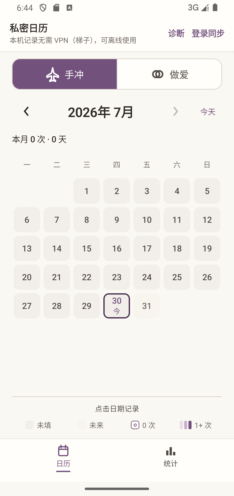
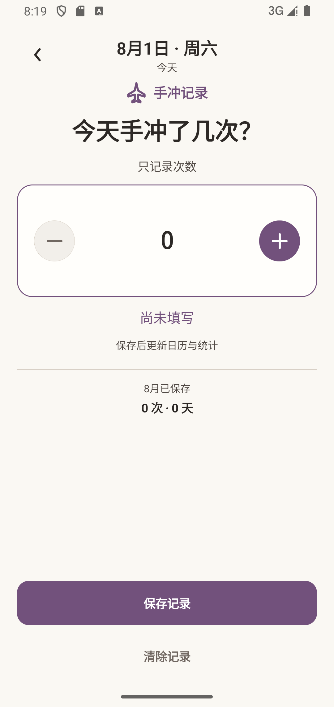
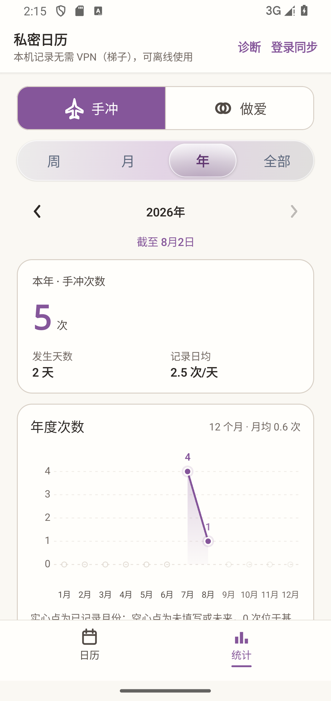

# 私密日历

[](https://github.com/LitaoG/daily-record-app/actions/workflows/android-ci.yml)
[](https://github.com/LitaoG/daily-record-app/releases)
[](https://github.com/LitaoG/daily-record-app/releases)
[](LICENSE)

一个本地优先的 Android 私密次数日历，分别记录“手冲”和“做爱”。无需登录即可使用；需要换机恢复时，可选择邮箱密码账号和 Firebase 云同步。当前 beta.2 已完成日历、日期记录、周/月/年/全部统计，以及两套模块主题适配。

<p align="center">
  
  
  
</p>

三张图分别展示当前日历、日期记录和年度统计的运行证据；对应双模块目标和状态语义见 [UI v2 设计基线](docs/product/design/quiet-private-journal-v2/README.md)。UI v2 Stage 0–6 已完成，后续只通过新的 Issue/PR 进入定向维护，不把历史生成图当作当前待办。

## 已实现

- 月历查看、相邻月份切换和 1970 年至今天的年月日快速跳转。
- 手冲与做爱两个独立模块；切换模块时保留浏览日期和统计周期，重启后恢复上次模块。
- 两个模块分别支持每日次数加减、显式保存 `0` 次、清除记录和未保存返回确认。
- 明确区分“未填写”“0 次”和正次数。
- 每个模块各自提供周、月、年和全部历史的总次数、发生天数、记录日均与明细，不合并总数。
- Room 本地数据库；断网时记录、日历和统计照常使用。
- 可选邮箱密码注册/登录、密码重置、跨设备恢复和离线待同步。
- 同步错误分级、脱敏诊断摘要以及账号与本人云端数据永久删除。
- TalkBack 语义、48dp 点击目标、200% 系统字体和应用内统一弹窗。

当前范围只包含手冲和做爱次数，不保存伴侣、时间、地点、时长、备注、图片或医疗信息，也不包含健身、提醒、目标、社交、广告或短信验证码。两个模块拥有独立实体、表、Repository 和云端路径，不使用万能活动表。

## 下载与安装

当前公开 Release 为双模块候选版 [`v1.0.0-beta.2`](https://github.com/LitaoG/daily-record-app/releases/tag/v1.0.0-beta.2)，包含手冲与做爱两个独立记录模块。

1. 从本仓库 [GitHub Releases](https://github.com/LitaoG/daily-record-app/releases) 下载 APK 和同名 `.sha256`。
2. 在 Windows PowerShell 中校验：

   ```powershell
   Get-FileHash .\hand-brew-calendar-v1.0.0-beta.2.apk -Algorithm SHA256
   Get-Content .\hand-brew-calendar-v1.0.0-beta.2.apk.sha256
   ```

3. 确认哈希一致后安装；Android 可能要求允许当前浏览器或文件管理器“安装未知应用”。

后续 Release 使用同一份稳定证书，可覆盖安装并保留 Room 数据。Android Studio Debug 版使用不同证书，首次切换前应先登录并确认“已同步”，再卸载 Debug 版、安装 Release 并登录恢复；未同步的纯本机数据无法跨卸载保留。

> 中国大陆普通网络下，本机记录、日历和统计不需要 VPN（梯子）。注册、登录、密码重置、云同步和云端删除依赖 Firebase，可能需要可访问 Firebase 的网络。

## 数据与隐私

- 所有记录先写入本机 Room；登录不是核心功能的前置条件。
- 云同步只在用户主动注册或登录后启用，并按 Firebase UID 隔离。
- 应用不含广告、分析 SDK 或社交功能，不自动上传诊断日志。
- Android 系统云备份已关闭；未同步的本机数据在卸载后无法恢复。
- 账号弹窗可以永久删除本人云端记录与 Firebase 账号，并选择是否保留本机记录。

完整说明见 [隐私说明](PRIVACY.md)、[同步与隐私](docs/SYNC_AND_PRIVACY.md)和[安全策略](SECURITY.md)。

## 技术栈

- Kotlin、Jetpack Compose、Material 3
- Coroutines、Flow、单向数据流
- Room v4、WorkManager
- Firebase Authentication、Cloud Firestore
- `minSdk 26`、`targetSdk 36`
- Apache License 2.0

## 开发与验证

需要 Android Studio 内置 JDK、Android SDK、Node.js/pnpm，以及一台 API 34 Android 模拟器。自动化设备测试会修改应用数据，只能在测试模拟器上运行，不要连接日常使用的真机。

日常开发按 [`测试策略与执行矩阵`](docs/TESTING.md) 运行受影响范围的定向测试；下面的完整套件只在一个连贯小版本的最终功能 head 上运行一次，不在每个小修改后机械重复。

```powershell
pnpm install --frozen-lockfile
pnpm test:docs
pnpm test:release-metadata
.\gradlew.bat testDebugUnitTest lintDebug assembleDebug assembleDebugAndroidTest --no-parallel
pnpm test:firestore-rules
pnpm test:android-connected
```

- Gradle 命令执行 JVM 测试、Lint 和 APK 编译，不会启动 Firebase 模拟器。
- `test:docs` 检查本地链接、截图、版本、Android SDK 和 Room schema 是否与工程一致。
- `test:firestore-rules` 会临时启动隔离的 Firestore 模拟器。
- `test:android-connected` 会启动隔离的 Auth/Firestore 模拟器，并在已启动的 Android 测试模拟器上执行完整设备套件。
- Release 签名、版本、tag 和覆盖升级流程见 [发布指南](docs/RELEASE.md)。

## 文档

[文档中心](docs/README.md)区分“当前事实文档”和“历史审计证据”。常用入口：

- [产品契约](docs/PRODUCT.md)
- [界面与交互](docs/UI_UX.md)
- [架构](docs/ARCHITECTURE.md)
- [数据模型](docs/DATA_MODEL.md)
- [统计口径](docs/STATISTICS.md)
- [开发与测试](docs/DEVELOPMENT.md)
- [测试策略与执行矩阵](docs/TESTING.md)
- [路线图](docs/ROADMAP.md)
- [决策记录](docs/DECISIONS.md)
- [仓库维护与文档生命周期](docs/REPOSITORY_HYGIENE.md)

公开仓库不包含 `app/google-services.json`、签名文件、密码、真实用户数据库、APK/AAB 或敏感日志。贡献前请阅读 [CONTRIBUTING.md](CONTRIBUTING.md)。
