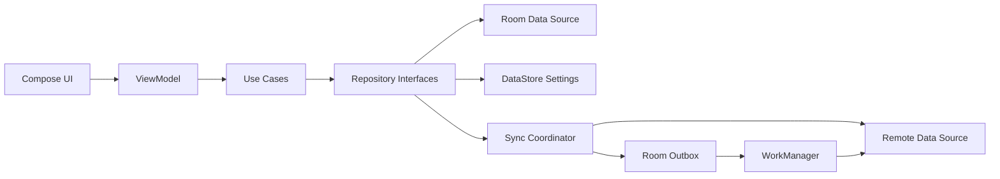

# 系统架构

## 1. 架构目标

- 离线可用，网络不是记录行为的前置条件。
- UI、业务规则、持久化和云服务相互隔离。
- 后端可替换，避免锁定具体 SDK。
- 数据结构支持新增活动和计量方式。
- 统计可测试、可重算、可解释。
- 数据库升级不破坏用户历史。

## 2. 推荐技术栈

- Kotlin
- Jetpack Compose + Material 3
- Navigation
- ViewModel + Coroutines + Flow
- Room
- WorkManager
- Hilt
- Kotlin Serialization
- Vico 或轻量自绘图表
- Kizitonwose Calendar，经过原型验证后决定是否引入

具体依赖版本在创建工程时通过 version catalog 统一管理，不在规划文档中固定容易过期的版本号。

## 3. 分层



### UI 层

- 展示不可变 `UiState`。
- 将用户操作作为事件传递给 ViewModel。
- 不直接访问 DAO、网络 SDK、认证 SDK或 WorkManager。

### Domain 层

- 承载跨页面复用或复杂的业务规则。
- 典型用例：保存每日记录、计算周期范围、合并游客数据、请求同步。
- 简单 CRUD 不为追求形式强制增加空壳用例。

### Data 层

- Repository 是上层访问数据的唯一入口。
- Room 是应用数据的单一事实来源。
- 远端数据成功获取后必须先写入 Room，UI 再从 Room 的 Flow 更新。
- 设置类数据使用 DataStore。

### Sync 层

- 本地变更和 Outbox 在同一数据库事务中提交。
- WorkManager 在满足网络条件时上传。
- 远端返回的数据转换为本地域模型后写入 Room。
- 同步失败不会回滚用户已看到的本地记录。

## 4. 模块方向

早期避免为了“架构完整”创建过多 Gradle 模块。代码增长后逐步形成：

```text
app
core:model
core:database
core:data
core:designsystem
core:network
core:testing
feature:calendar
feature:record
feature:statistics
feature:activities
feature:account
feature:settings
sync
```

在 Phase 1 可以先采用较少物理模块，但 package 和依赖方向必须遵循上述边界。

## 5. 状态与数据流

1. 用户在 Compose 中点击 `+1`。
2. ViewModel 调用保存记录用例。
3. Repository 在 Room 事务中更新记录并创建 Outbox 操作。
4. Room Flow 立即发出新值，UI 和统计更新。
5. WorkManager 稍后上传操作。
6. 服务端确认后清理 Outbox 或更新同步版本。

## 6. 日期与时间

- 统计主键使用用户记录时的 `LocalDate`，不是从 UTC 时间临时推导。
- 同时保存 `occurredAt` 和 `timezoneId`，为审计及未来详细记录保留依据。
- 周范围由用户设置的周起始日决定，默认星期一。
- 数据查询使用半开区间 `[startDate, endExclusive)`，减少边界错误。
- 必须测试闰年、月末、跨年周、夏令时和时区变更。

## 7. 可替换后端

领域层只依赖以下抽象能力：

- 身份注册、登录、退出和会话观察。
- 按版本拉取用户数据变更。
- 批量上传幂等变更。
- 软删除和确认删除。
- 服务端按用户执行授权。

Supabase、Firebase 或自建 API 的 SDK 只能出现在远端数据源实现中。

## 8. 质量属性

- 正确性优先于图表丰富度。
- 记录操作的本地响应目标小于 100ms，不包含首次数据库初始化。
- 日历月查询只读取需要的日期范围。
- 年度统计避免在主线程执行。
- 所有数据库迁移必须保留历史并通过自动测试。
- 所有同步写入使用幂等 ID，允许安全重试。

