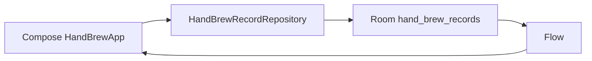

# 系统架构

## 目标

- 专注单一手冲记录，不建立通用活动框架。
- 离线可用，记录反馈及时。
- Room 是唯一业务事实来源。
- 统计可重算、迁移可验证、代码边界清楚。

## 数据流



UI 不直接访问 DAO。`HandBrewApp` 订阅 Repository 暴露的 Flow，并把不可变记录列表传给日历、记录与统计屏幕；保存和清除也只调用 Repository。Repository 负责同日 upsert、范围校验和数据映射；DAO 负责日期范围和统计查询。当前 UI 状态很小，先使用 Compose 可保存状态；只有状态复杂度证明需要时才引入 ViewModel。

## 包结构

```text
app
└─ io.github.litaog.dailyrecord
   ├─ core:model       HandBrewRecord / HandBrewSummary
   ├─ core:database    Room entity / DAO / migration
   ├─ core:data        repository interface / implementation
   └─ ui
      ├─ calendar      CalendarScreen
      ├─ record        RecordScreen
      ├─ statistics    StatisticsScreen / StatisticsModels
      ├─ components    shared Compose components
      └─ theme         Figma token mapping
```

早期保持单一 Gradle 模块；只有构建时间或团队规模证明需要时才拆物理模块。

## 日期规则

- 业务主键是用户选择的 `LocalDate`。
- 范围查询统一使用 `[startDate, endExclusive)`。
- 周固定从星期一开始，避免为单一用途增加设置系统。
- 已保存日期不会因设备时区变化自动移动。

## 数据库演进

Room 当前版本为 2。v1 通用活动表迁移时只提取名称为“手冲”或旧飞机图标标识的记录；旧表改名为 `legacy_*_v1` 保留作恢复证据，但运行时代码不读取它们。后续确认迁移稳定后，才可通过独立、可审计迁移移除 legacy 表。

禁止 destructive migration。
