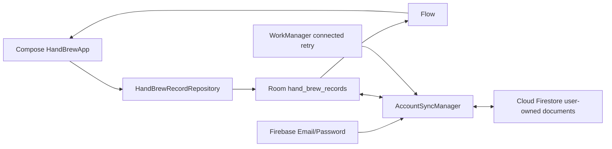

# 系统架构

## 目标

- 专注单一手冲记录，不建立通用活动框架。
- 离线可用，记录反馈及时。
- Room 是唯一业务事实来源。
- 账号和云端是可选恢复通道，不阻塞本地记录。
- 统计可重算、迁移可验证、代码边界清楚。

## 数据流



UI 不直接访问 DAO 或 Firestore。`HandBrewApp` 只订阅 Repository 暴露的 Room Flow；保存和清除先落 Room，再由同步协调器异步上传。Repository 负责同日 upsert、单调修改时间、范围校验和映射；DAO 负责账号隔离、日期范围、墓碑和待同步查询。Firestore 快照也必须先合并进 Room，UI 不读取远端缓存。当前 UI 状态使用 Compose 可保存状态；只有状态复杂度证明需要时才引入 ViewModel。

用户明确选择的本机模式使用一个专用 SharedPreferences 布尔值持久化，避免冷启动反复要求选择登录；它不存业务记录、邮箱或密码。Firebase 已登录状态仍以 Authentication 为准。

## 包结构

```text
app
└─ io.github.litaog.dailyrecord
   ├─ core:model       HandBrewRecord / HandBrewSummary
   ├─ core:database    Room entity / DAO / migration
   ├─ core:data        repository interface / implementation
   ├─ core:auth        email/password auth boundary
   ├─ core:cloud       Firebase bootstrap
   ├─ core:sync        remote source / coordinator / worker
   └─ ui
      ├─ calendar      CalendarScreen
      ├─ record        RecordScreen
      ├─ statistics    StatisticsScreen / StatisticsModels
      ├─ components    shared Compose components
      └─ theme         Figma token mapping
```

早期保持单一 Gradle 模块；只有构建时间或团队规模证明需要时才拆物理模块。

## 日期规则

- 业务主键是用户选择的 `LocalDate`。
- 范围查询统一使用 `[startDate, endExclusive)`。
- 周固定从星期一开始，避免为单一用途增加设置系统。
- 已保存日期不会因设备时区变化自动移动。

## 数据库演进

Room 当前版本为 3。v1→v2 只提取名称为“手冲”或旧飞机图标标识的记录；旧表改名为 `legacy_*_v1` 保留作恢复证据。v2→v3 为每条记录增加账号所有者、墓碑、同步状态和远端修订号；旧记录迁到 `__local__` 本机空间并标记为待同步。运行时代码不读取 legacy 表。

禁止 destructive migration。

## 同步边界

- Firestore 路径固定为 `/users/{uid}/handBrewRecords/{YYYY-MM-DD}`。
- 远端不能直接覆盖本地待同步版本；提交确认也必须匹配发起提交的本地版本。
- 删除只写墓碑，不允许客户端物理删除。
- 新登录会先获取服务器快照，再把 `__local__` 记录按日期合并到账号空间。
- 冲突使用 `clientUpdatedAt`；较新修改获胜，相同时间保留服务器版本。
- 实时监听负责跨设备更新，WorkManager 与网络恢复负责补偿重试。
- 实时监听发生瞬时错误后使用最高 30 秒的指数退避重新订阅；离线时先等待有效网络，取消页面作用域会同时取消等待与重试。

## 启动、取消与实时编辑

- 已持久化选择本机模式时，根界面先进入本机分支，Firebase 服务保持惰性，不参与离线冷启动。只有进入登录或已登录路径时才初始化 Firebase。
- Room 首次 `Flow` 发射前使用显式“正在读取本机记录”状态，不能用空列表冒充真实的 0 次、0 天。
- 认证、同步管理器和 WorkManager 都显式继续抛出 `CancellationException`；页面离开、网络状态切换或工作取消不会被误记为普通同步失败。
- 手动同步被取消时先恢复进入同步前的状态，再继续传播取消，避免账号栏永久停留在“同步中”。
- 记录页维护“服务端/Room 基线次数”和“本机草稿次数”。跨设备更新到达且用户尚未编辑时刷新草稿；用户已经编辑时保留草稿，并继续以最新基线判断未保存状态。
- Room 事务提交成功即视为记录成功；后续 WorkManager 调度属于尽力而为，调度异常不会把已经落盘的数据误报为保存失败。
