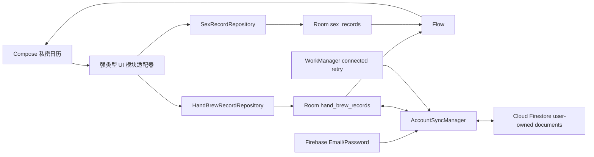

# 系统架构

最后复核：2026-08-09

## 目标

- 专注手冲与做爱两个固定、独立的垂直模块，不建立通用活动框架。
- 离线可用，记录反馈及时。
- Room 是唯一业务事实来源。
- 账号和云端是可选恢复通道，不阻塞本地记录。
- 统计可重算、迁移可验证、代码边界清楚。

## 数据流


```mermaid
flowchart LR
    UI[Compose 私密日历] --> ROUTE[强类型 UI 模块适配器]
    ROUTE --> BREW[HandBrewRecordRepository]
    ROUTE --> SEX[SexRecordRepository]
    BREW --> ROOM[Room hand_brew_records]
    SEX --> ROOM2[Room sex_records]
    ROOM --> FLOW[Flow]
    ROOM2 --> FLOW
    FLOW --> UI
    AUTH[Firebase Email/Password] --> SYNC[AccountSyncManager]
    ROOM <--> SYNC
    SYNC <--> CLOUD[Cloud Firestore user-owned documents]
    WORK[WorkManager connected retry] --> SYNC
```

UI 不直接访问 DAO 或 Firestore。`DailyCountRecord` 与 `DailyCountRecordRepository<T>` 只提供日期、次数和时间戳这组最小公共契约；UI 适配器把强类型的 `HandBrewRecord` / `SexRecord` 投影为共享日期次数组件，保存时仍由对应模块创建领域记录并回到对应 Repository。保存和清除先落 Room，再由组合协调器驱动独立同步链路。Firestore 快照也必须先合并进各自 Room 表，UI 不读取远端缓存。

用户明确选择的本机模式和上次选择的记录模块分别使用专用 SharedPreferences 持久化；它们不存业务记录、邮箱或密码。从本机日历打开登录页是进程内导航状态，只有认证成功后才关闭本机偏好；登录页返回或登录中断不会改变既有本机入口。Firebase 已登录状态仍以 Authentication 为准。

设置中心是 Compose 外壳中的次级页面，不进入底部主导航。它复用账号弹窗和既有模块选择偏好，只读取构建版本与静态隐私事实；不直接访问 DAO、Firestore，也不引入新的业务数据表或通用设置模型。

本轮没有新增记录模块。未来若增加记录类型，仍必须采用独立领域模型、Room 表、Repository 和远端集合；账号同步、账号删除和 UI 外壳通过模块列表聚合，避免把业务字段塞回旧通用活动表。

## 包结构

```text
app
└─ io.github.litaog.dailyrecord
   ├─ core:model       HandBrewRecord / SexRecord
   ├─ core:database    two independent entities / DAOs / migration
   ├─ core:data        two independent repositories
   ├─ core:auth        email/password and reset-email boundary
   ├─ core:cloud       Firebase bootstrap
   ├─ core:common      shared invariants and user-facing copy
   ├─ core:sync        remote source / coordinator / worker
   └─ ui
      ├─ calendar      CalendarScreen
      ├─ record        RecordScreen
      ├─ statistics    StatisticsScreen / StatisticsModels
      ├─ settings      SettingsScreen
      ├─ components    shared Compose components
      └─ theme         Figma token mapping
```

早期保持单一 Gradle 模块；只有构建时间或团队规模证明需要时才拆物理模块。

## 文案与显示格式

用户可见的标题、按钮、状态、错误提示、无障碍描述和日期/次数格式统一收敛到
`core/common/AppCopy.kt` 的分组对象中。Compose 页面和同步层只引用这些入口，动态
文案由集中函数接收数据生成；领域错误码、Firestore 字段名和数据库迁移 SQL 仍保留
在各自的技术边界中，不把技术标识伪装成界面文案。新增文案先加入 `AppCopy`，再在
调用处引用，避免同义文案分散、模块之间漂移和后续本地化时逐文件搜索。

## 功能演进边界

- 当前运行时有手冲与做爱两个垂直切片；实体、表、DAO、Repository、远端字段和 Firestore 路径保持专用语义。
- 账号外壳、日期导航、主题、可取消操作结果和基础反馈等语义一致的能力可以复用。
- 两个真实模块已证明相同的日期导航、次数编辑、统计纯函数和冲突流程由强类型 UI 适配器与 `DailyCountSyncEngine` 共享。
- `CombinedSyncCoordinator`、`CombinedAccountRemoteDataStore` 与 `CombinedAccountDeletionLocalStore` 接受非空模块列表；新增模块不需要继续扩展手冲/做爱的二元构造逻辑。兼容构造函数只服务当前两个模块的组合入口。
- 未来新增记录类型时，先建立 ADR，再新增自己的领域实体、Repository、统计计算、同步路径和迁移测试；不向既有记录塞活动 ID，也不建立万能字段。

## 日期规则

- 业务主键是用户选择的 `LocalDate`。
- 范围查询统一使用 `[startDate, endExclusive)`。
- 周固定从星期一开始，避免为单一用途增加设置系统。
- 已保存日期不会因设备时区变化自动移动。

## 数据库演进

Room 当前版本为 4。v1→v2 只提取旧 `flight` 机器图标标识的记录，不依赖用户可见名称；旧表改名为 `legacy_*_v1` 保留作恢复证据。v2→v3 为手冲记录增加账号所有者、墓碑、同步状态和远端修订号。v3→v4 非破坏地创建空的 `sex_records`，不改写任何手冲行。运行时代码不读取 legacy 表。

禁止 destructive migration。

## 同步边界

- Firestore 路径分别固定为 `/users/{uid}/handBrewRecords/{YYYY-MM-DD}` 与 `/users/{uid}/sexRecords/{YYYY-MM-DD}`。
- `CombinedSyncCoordinator` 只按模块列表聚合账号状态、待同步数量和后台触发；每个模块仍使用自己的 Store、RemoteDataSource 和映射。
- 远端不能直接覆盖本地待同步版本；提交确认也必须匹配发起提交的本地版本。
- 删除只写墓碑，不允许客户端物理删除。
- 新登录先在单个 Room 事务中把 `__local__` 记录按日期合并到账号空间，再开始任何 Firestore 请求；因此云端不可达时本机数据仍立即可见且保持 `PENDING`。
- 冲突使用本地保存的 `remoteRevision` 作为乐观并发基线；修订不一致时保留服务器版本，设备时钟只作为展示和本机单调编辑元数据，不决定跨设备胜负。
- 首次把无云端基线的本机记录迁入账号时，先对齐已存在日期的当前云端修订，再提交本机版本。
- 实时监听负责跨设备更新，WorkManager 与网络恢复负责补偿重试；本地变化使用 `APPEND_OR_REPLACE` 保留运行中任务之后的新同步请求。
- 后台同步当前使用稳定的 `daily-record-cloud-sync` 唯一工作名；升级时会一次性取消旧的 `hand-brew-cloud-sync` 工作，避免历史单模块任务继续运行。
- 永久删除账号会先写入按账号持久化的删除阻断标记，再取消任务并等待已经取得云写入闸门的同步完成；新的 Worker、实时补偿和本地变更调度在闸门期间不能写回该账号。中途取消会释放进程锁但保留标记，重试或启动清理完成后才解除阻断。
- Firestore 快照逐文档解析，格式异常的单条记录不会关闭整个实时流或阻断其他日期；账号状态会显示数据类错误。
- 实时监听发生瞬时错误后使用最高 30 秒的指数退避重新订阅；离线时先等待有效网络，取消页面作用域会同时取消等待与重试。
- Android 仍可能把网络判定为有效但 Firebase 被阻断；实时监听收到新的服务器快照时会把它视为服务恢复信号，并主动冲刷 Room 中的待同步记录。
- 登录、注册、密码重置和手动同步使用 5 秒交互截止时间。并发同步触发会合并为正在进行的一次请求，截止时间只覆盖实际远端请求；网络恢复和实时快照触发的后台补偿使用 30 秒截止时间，WorkManager 仍负责最终重试。超时按网络不可达反馈，生命周期取消仍继续向上传播，不伪装成失败。

## 启动、取消与实时编辑

- 已持久化选择本机模式时，根界面先进入本机分支，Firebase 服务保持惰性，不参与离线冷启动。只有进入登录或已登录路径时才初始化 Firebase。
- Room 首次 `Flow` 发射前使用显式“正在读取本机记录”状态，不能用空列表冒充真实的 0 次、0 天。
- 认证、同步管理器和 WorkManager 都显式继续抛出 `CancellationException`；页面离开、网络状态切换或工作取消不会被误记为普通同步失败。
- 手动同步被取消时先恢复进入同步前的状态，再继续传播取消，避免账号栏永久停留在“同步中”。
- 记录页维护“服务端/Room 基线次数”和“本机草稿次数”。跨设备更新到达且用户尚未编辑时刷新草稿；用户已经编辑时保留草稿，并继续以最新基线判断未保存状态。
- Room 事务提交成功即视为记录成功；后续 WorkManager 调度属于尽力而为，调度异常不会把已经落盘的数据误报为保存失败。
