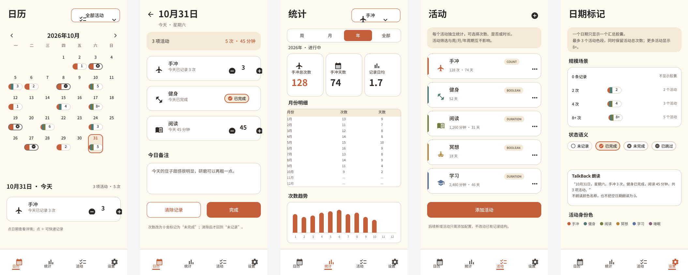
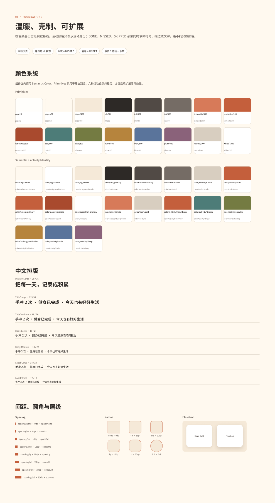
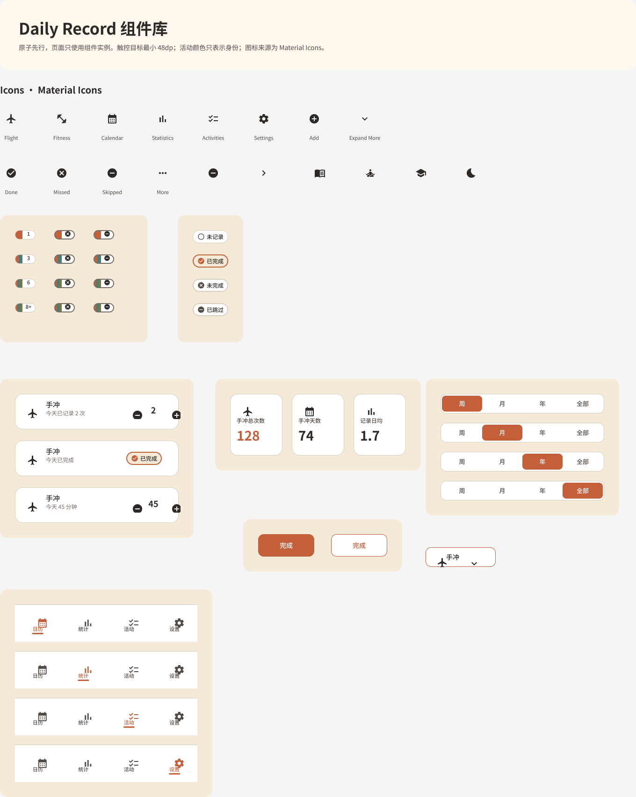
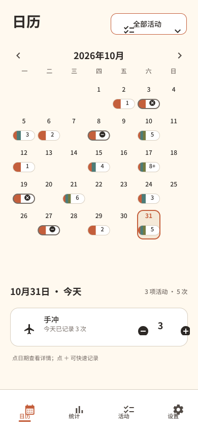
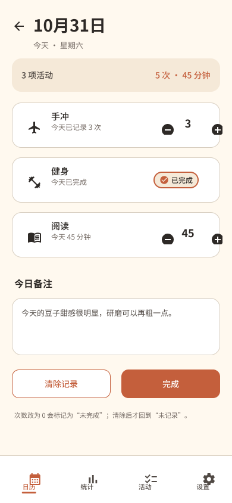
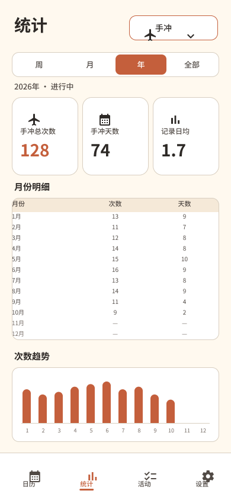
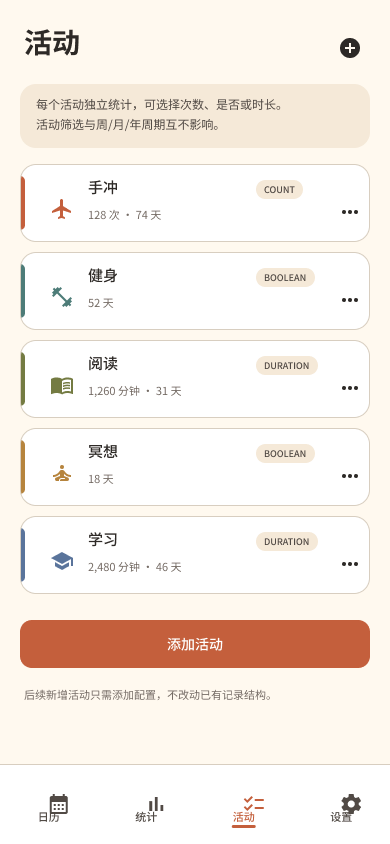
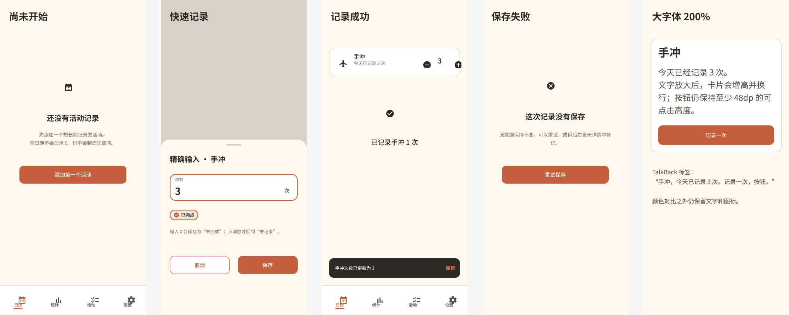

# Figma 设计系统与 Android 交接 v1

状态：原生设计系统完成；可进入可用性测试与 Compose 实现准备
更新时间：2026-07-16

## 1. 设计入口

- [Figma 原生设计文件](https://www.figma.com/design/PMtsNNL81BHl9HyJYhjbdw)
- 文件 key：`PMtsNNL81BHl9HyJYhjbdw`
- 基准画布：Android `390 × 844`
- 视觉方向：暖色纸感日志；手冲使用飞机图标；Material Icons + Noto Sans SC

## 2. 页面结构

Figma 文件按交付顺序拆分为 5 页：

1. `00 Cover`：设计目标、版本、实现护栏。
2. `01 Foundations`：颜色、字体、间距、圆角、描边与阴影。
3. `02 Components`：日期汇总、状态、活动记录、指标、周期、筛选、导航和按钮。
4. `03 Screens`：月历、日期详情、统计、活动管理、标记系统。
5. `04 States & Accessibility`：空状态、精确输入、撤销、保存失败、大字号与 TalkBack。

## 3. Foundations

- 5 个变量集合、51 个变量：Primitives 16、Semantic Color 19、Spacing 8、Radius 6、Stroke 2。
- 19 个语义色全部引用基础色，不在页面中重复定义颜色事实。
- 51 个变量均配置 Android code syntax，方便映射为 Compose token。
- 7 个 Noto Sans SC 文本样式：Display/Large、Title/Large、Title/Medium、Body/Large、Body/Medium、Label/Large、Label/Small。
- 2 个阴影样式：Elevation/Card Soft、Elevation/Floating。

## 4. 组件清单

| 组件 | 变体/属性 | Compose 建议 |
|---|---|---|
| `Calendar/Date Summary` | 12 个变体：One/Two/Three/Overflow × Done/Missed/Skipped | 单日期只渲染一个汇总胶囊；最多 3 色段；8 项及以上显示 `8+` |
| `Status/Badge` | UNSET/DONE/MISSED/SKIPPED | 状态必须同时使用图标、文字、描边或形态，不能只靠颜色 |
| `Record/Activity Row` | COUNT/BOOLEAN/DURATION；图标、标题、摘要属性 | 使用同一数据模型和通用行组件，不为活动复制页面 |
| `Stats/Metric Card` | Count/Days/Average | 指标卡从同一聚合结果读取 |
| `Control/Period` | Week/Month/Year/All | 周期作用域与活动筛选作用域互相独立 |
| `Navigation/Bottom` | Calendar/Statistics/Activities/Settings | 对应四个一级目的地 |
| `Button/Action` | Primary/Outline | 主要动作与次要动作统一尺寸和状态 |
| `Control/Activity Filter` | 实例交换图标、标题 | 单活动统计不得混入其他活动 |

共 7 个组件集和 1 个独立筛选组件；图标使用可复用 Material Icons 组件，包括 Flight、Fitness、Calendar、Statistics、Activities、Settings、Add、Done、Missed、Skipped 等。

## 5. 核心页面

### 月历

- 默认主入口；每个日期最多一个汇总胶囊。
- 空日期不显示 `0`；选中日期才展开精确信息。
- 日期 31 和快速记录行已连接到日期详情。

### 日期详情

- 同屏覆盖 COUNT、BOOLEAN、DURATION。
- 示例：手冲 3 次、健身已完成、阅读 45 分钟。
- 次数降为 0 进入 `MISSED`；只有清除记录回到 `UNSET`。

### 统计

- 单活动筛选为“手冲”，未混入健身指标。
- 年度 fixture：手冲总次数 128、手冲天数 74、记录日均 1.7。
- 1—10 月有实际数据；11—12 月为空值；趋势只有 10 根数据柱，不预测未来。
- 表格、汇总卡和趋势使用同一 fixture，原 PNG 的统计矛盾已在 Figma v1 中修复。

### 活动管理

- 示例覆盖手冲 COUNT、健身 BOOLEAN、阅读 DURATION，以及冥想、学习等扩展活动。
- 活动身份色跨页面保持稳定；新增活动通过配置进入通用结构。

### 标记系统

标记系统包含在[主页面总览](assets/figma-v1/03-screens-overview.png)中，覆盖 0/2/4/8+、四种记录状态、活动身份图例和 TalkBack 描述示例。

## 6. 状态与无障碍

- 空状态：没有活动或记录时给出明确下一步。
- 精确输入：步进以外可直接输入非负数值。
- 撤销：保存后提供轻量 snackbar，允许恢复误操作。
- 保存失败：保留编辑值，明确“未保存”，提供重试。
- 大字号与 TalkBack：包含 200% 字号示例、语义描述与非颜色编码。

## 7. 原型交互

- 核心页面共 19 个 prototype reactions。
- 月历日期/快速记录 → 日期详情；详情返回 → 月历。
- 四个底部导航目的地已建立跨屏跳转。
- 本轮没有设置单独 Flow starting point；开发与测试应从月历页面开始。

## 8. 结构 QA

- 5 个主页面与 5 个异常/无障碍页面均为 `390 × 844`。
- 无缺失字体、无可见溢出。
- 统计页不包含健身指标；存在 128、74、1.7；未来空值 4 个；趋势数据柱 10 个。
- 月历不包含默认 `0` 标记。
- 日期格已覆盖 0/2/4/8+ 压力场景。
- 组件与页面使用相同变量、文本样式和图标库。

结构 QA 已通过，但“进入 Ready”的产品门槛不变：仍需完成 5 人任务测试，核心任务完成率 ≥90%、常用记录中位用时 ≤5 秒、统计理解率 ≥80%。

## 9. Android 实现顺序

1. 数据模型 #5：固定 `MeasurementType` 与 `RecordStatus`。
2. 快速记录 #6：COUNT/BOOLEAN/DURATION、精确输入、失败/重试/撤销。
3. 日历 #4：汇总胶囊、活动筛选、日期详情和无障碍语义。
4. 统计 #7：共享聚合结果、周/月/年/全部历史、固定 fixture 测试。

本设计交付不引入运行时依赖。Kizitonwose Calendar、Room、Vico 等仍按[开发准备度基线](IMPLEMENTATION_READINESS.md)在工程阶段单独评估。

## 10. Figma Make 记录

Figma Make 仅作为可选视觉探索，不是产品事实来源，也没有覆盖原生设计文件。本轮在 Chrome 中进入 Make 并准备提示词，但页面交互连续超时；随后 Figma Education MCP 达到本轮调用上限，因此未生成或写回 Make 方案。原生变量、组件、页面、交互和 QA 均已完成，不受此限制影响。
