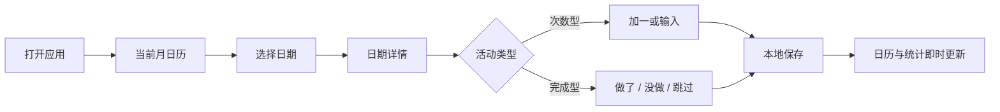

# 信息架构与核心流程

更新时间：2026-07-16

## 1. 主导航

```text
Daily Record
├── 日历（默认）
│   ├── 月份切换 / 回到今天
│   ├── 活动筛选
│   └── 日期详情
│       ├── 次数型快速记录
│       ├── 完成型状态记录
│       └── 备注与清除
├── 统计
│   ├── 活动选择
│   ├── 全部 / 周 / 月 / 年
│   ├── 汇总指标
│   ├── 精确表格
│   └── 趋势图 / 热力图（P1）
├── 活动
│   ├── 活动列表与排序
│   ├── 新建 / 编辑
│   └── 归档
└── 设置
    ├── 外观与一周起始日
    ├── 导入导出（P1）
    ├── 隐私锁（P1）
    └── 账户与同步（P2）
```

## 2. 页面职责

| 页面 | 第一任务 | 第一屏必须展示 | 不应承担 |
|---|---|---|---|
| 日历 | 找日期并记录 | 当前月、今天、活动汇总胶囊、选中日期 | 复杂趋势解释 |
| 日期详情 | 修改某一天事实 | 日期、活动、状态/数量、即时反馈 | 云同步阻塞状态 |
| 统计 | 回顾趋势与精确值 | 活动、周期、主指标、表格入口 | 修改活动配置 |
| 活动 | 管理记录模板 | 名称、颜色、类型、排序、归档 | 每日记录 |
| 设置 | 控制全局偏好 | 主题、周起始、隐私与数据入口 | 核心记录 |

## 3. 核心记录流程



可编辑版本位于 [FigJam 产品发现板](https://www.figma.com/board/QPalmez5kHyjeaLXeJeZ6y)。

## 4. 交互优先级

### 日历第一屏

1. 当前月份和今天。
2. 每日活动标记。
3. 当前选择日期的活动记录。
4. 活动筛选。
5. 次要入口与设置。

### 日期详情

1. 活动名称与基础色。
2. 最常用动作：次数型为 `+1`，完成型为 `DONE`。
3. 当前数量或状态。
4. 没做、跳过、直接输入、清除等次要动作。
5. 可选备注。

## 5. 低保真原型范围

第一版 Figma 原型只覆盖完成核心任务所需的四个移动端画面：

1. 当前月日历：包含空状态、今天、选中、0/2/4/8+ 活动汇总胶囊。
2. 日期详情：同时展示手冲次数型与健身完成型活动。
3. 统计总览：总次数、总天数和周/月/年切换。
4. 活动管理：通用活动列表、新建和归档入口。

三套视觉方向选定前不扩展到登录、同步、深色主题或发布物料。
