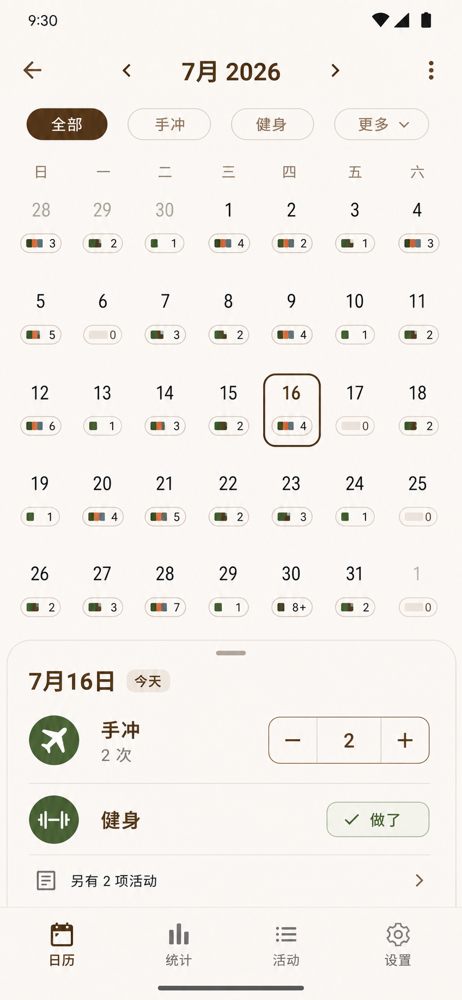
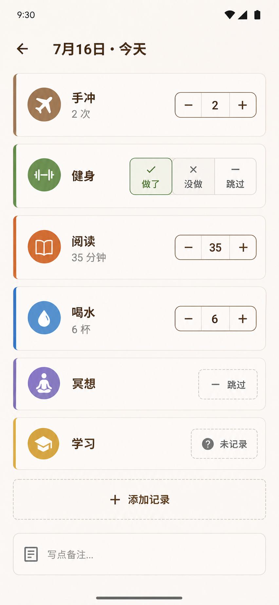
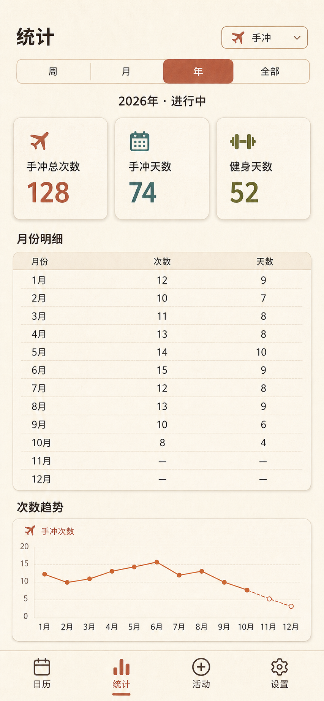
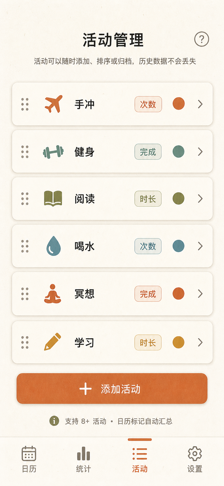
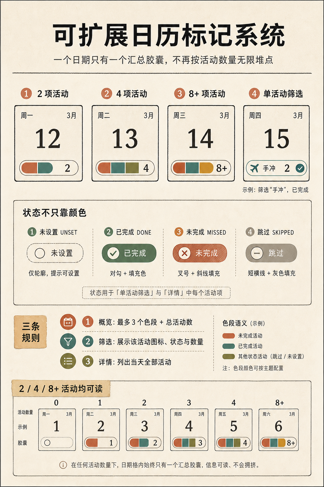

# 视觉原型 v1

状态：可评审
更新时间：2026-07-16

## 1. 月历概览

验证点：月历优先、活动筛选、单个汇总胶囊、`8+` 压力场景、当日快速记录、手冲飞机图标。

## 2. 日期详情

验证点：6 项活动同屏仍可扫描；次数、时长、完成、跳过、未设置状态使用通用结构。

## 3. 统计

验证点：周/月/年/全部周期、总次数与总天数分离、月份明细优先、趋势图为辅助、不展示无分母的完成率。

## 4. 活动管理

验证点：飞机代表手冲；活动支持次数、完成、时长三种测量类型；可排序、编辑、归档并继续增加到 8+。

## 5. 日历标记组件规范

验证点：一日期一胶囊、最多 3 色段、总活动数、单活动筛选和不只靠颜色的四状态编码。

## 设计协作入口

- [FigJam 产品发现板](https://www.figma.com/board/QPalmez5kHyjeaLXeJeZ6y)
- [Figma 可编辑原型工作区](https://www.figma.com/design/PMtsNNL81BHl9HyJYhjbdw)
- [Canva 产品发现一页图](https://www.canva.com/d/KznYpPjwrrcB0Vx)

本轮 Figma Starter MCP 写入额度已到上限，暂未把仓库视觉稿转换为 Figma 原生可编辑图层。仓库中的 PNG 和对应 Markdown 是当前评审基线；额度恢复后只做组件化迁移，不重新讨论已冻结的产品规则。

## 评审结论门槛

进入 Android UI 实现前，至少完成 5 名目标用户的任务测试，并满足：核心任务完成率不低于 90%、常用记录中位用时不超过 5 秒、4/8+ 活动汇总数识别正确率不低于 90%。
