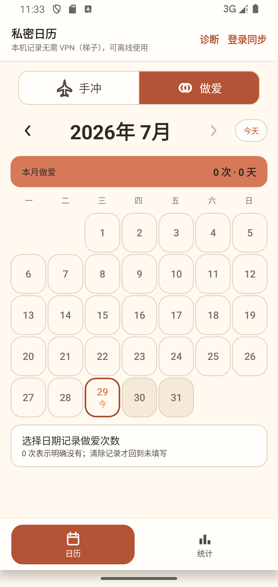
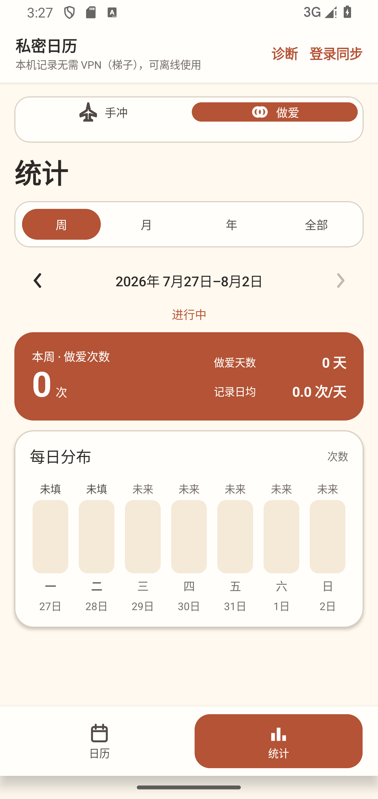
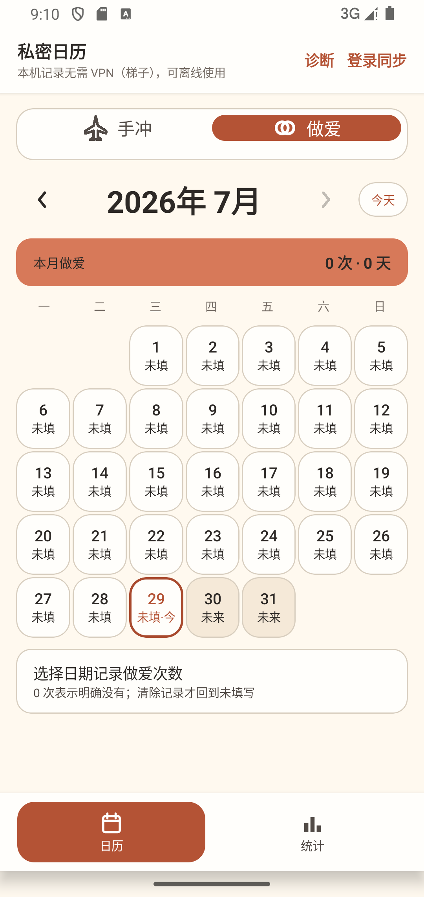
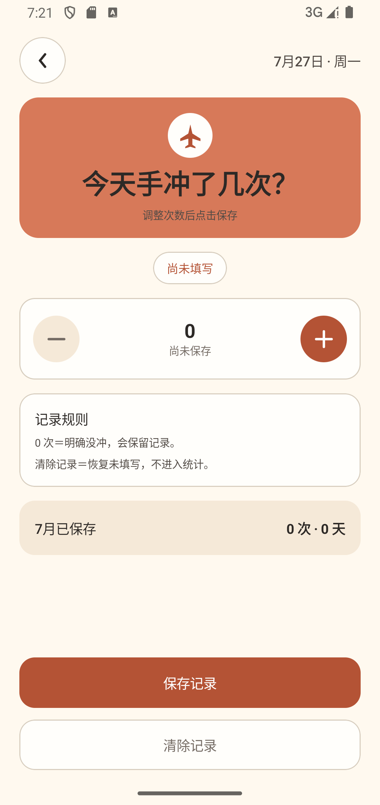

# 私密日历 UI 视觉重构：竞品研究与决策基线

状态：`Accepted research baseline`

研究日期：2026-07-29；Stage 4 刷新：2026-08-01

适用范围：手冲与做爱两个独立日期次数模块

已确认视觉目标：[安静的私密数据日志 UI v2 设计基线](design/quiet-private-journal-v2/README.md)

> 2026-07-29 更新：研究阶段的“手冲深铜＋做爱深梅”探索色已被用户确认的“手冲紫色＋做爱深红”替代。本文的竞品观察继续保留，但实施颜色、三张目标页面和阶段顺序以设计基线与[分阶段 Goal](QUIET_PRIVATE_JOURNAL_GOALS.md)为准。

> 2026-08-01 Stage 4 刷新：公开的 HabitHeat、HabitKit、HabitBox 和 Vico 资料进一步支持“低噪声月热力＋手机友好的年度 12 个月分析”。本文早期关于“年度逐日热力图”的探索记录保留为历史研究，不再是当前实现目标；当前契约以 [Stage 4 审计](audit/2026-08-01-ui-v2-stage4/README.md) 和 [统计口径](../STATISTICS.md) 为准。

## 1. 文档目的

这份文档把 2026-07-29 的联网竞品研究、当前运行界面审计和后续视觉方向固定为仓库基线，防止后续设计或实现只根据某一张截图、一次聊天反馈或临时审美重新解释产品。

它不是当前运行行为的替代说明，也不是已经批准的像素级设计稿。发生冲突时按以下顺序处理：

1. [`PRODUCT.md`](../PRODUCT.md)、[`DATA_MODEL.md`](../DATA_MODEL.md)、[`STATISTICS.md`](../STATISTICS.md) 和 [`DECISIONS.md`](../DECISIONS.md) 继续定义产品、数据和统计事实。
2. [`UI_UX.md`](../UI_UX.md) 定义当前已实现的交互和无障碍行为。
3. 本文定义下一轮视觉重构的研究结论、方向、禁止偏离项和验收门槛。
4. 历史 Figma、Canva、截图和旧审计只用于解释当时状态，不能覆盖上面三类当前规则。

任何与本文推荐方向明显冲突的视觉改动，都应先更新本文并说明新证据，而不是在代码中悄悄改变方向。

## 2. 不可被视觉重构改变的产品契约

产品是一个极简、私密、本地优先的日期次数日历，只记录两个固定且独立的模块：

- 手冲。
- 做爱。

每个模块只保存“本地日期＋当天次数”，并且必须区分：

- 未填写：数据库中没有当前模块、当前日期的有效记录。
- 明确 0 次：用户主动保存了 0。
- 正次数：用户保存了大于 0 的整数。

视觉重构不得借机加入以下范围：

- 时间、时长、伴侣、地点、体位、备注、图片、心情或医疗信息。
- 连续天数、戒色目标、打卡奖励、排行榜、社交、预测或推荐。
- 通用活动表、自定义活动、活动颜色管理或万能计量模型。
- 把手冲与做爱合并统计，或让一个模块读取、清除另一个模块的数据。

以下行为必须保持：

- 两个模块各自拥有独立实体、表、Repository、云端路径和统计结果。
- 保存 0 次不等于清除；清除才恢复未填写。
- 日历、记录页和统计页共享同一浏览日期。
- 模块切换不重置当前月份、浏览日期或统计周期。
- 未来日期不可记录。
- 本机模式、离线记录、可选邮箱密码同步及既有错误分级不被视觉方案阻塞。
- 关键触控目标至少 48dp，状态不能只依赖颜色，TalkBack 语义和 200% 系统字体能力不能倒退。

## 3. 研究方法与证据等级

本轮使用公开网页搜索、产品官网、Apple App Store、Google Play、公开截图、可信产品介绍、GitHub 仓库页面和当前 Android 运行截图进行黑盒研究，没有反编译闭源应用，也没有提取闭源资源。

证据优先级：

1. 官方网站、官方商店页面和官方 GitHub 仓库。
2. 官方发布的产品截图、视频和帮助资料。
3. 可核对来源的公开评测或截图文章。
4. Dribbble、Behance 等概念稿只用于辅助理解，不作为功能事实。

限制：

- 商店文案只能证明公开声明的能力，不能证明完整运行行为、安全实现或所有边界情况。
- 没有明确写出的“支持自慰”“同一天多次”等能力统一标记为“信息不足”，不根据截图猜测为事实。
- 部分闭源产品公开截图有限，无法完成像素级、动效或完整无障碍审计。
- Star 数和维护状态是 2026-07-29 的公开快照，后续会变化。
- 当前界面的 200% 字体风险同时参考代码和既有运行证据；未实际覆盖的组合状态仍需在实现阶段验证。

## 4. 当前运行界面证据

当前日历、统计与模块切换证据来自 PR #35 对应的 API 34 运行截图：







记录页结构参考最近一次真实运行审计：



截图只证明对应视口与状态；代码证据用于补充其他日期状态、统计周期和大字体分支。

早期任务清单中的 `HandBrewComponents.kt` 已在当前双模块应用壳中重命名为
[`DailyRecordComponents.kt`](../../app/src/main/java/io/github/litaog/dailyrecord/ui/components/DailyRecordComponents.kt)；
后者才是模块切换器、底部导航、周期切换、指标卡和次数控件的当前证据。

## 5. 当前设计已经做对的部分

后续视觉重构必须保留这些成果，不能为了“高级感”重新破坏：

1. **模块切换器已经是正确的单层结构。**
   [`DailyRecordComponents.kt`](../../app/src/main/java/io/github/litaog/dailyrecord/ui/components/DailyRecordComponents.kt) 的 `RecordModuleSelector` 让左右模块各占外框完整半区，选中背景和点击范围一致，中线是单独分隔线；不存在“外框内再套一个小胶囊”的双层问题。

2. **日历已经减少可见汉字。**
   [`CalendarScreen.kt`](../../app/src/main/java/io/github/litaog/dailyrecord/ui/calendar/CalendarScreen.kt) 的 `CalendarDayCell` 不再为普通未填写日期显示“未填”，也不再为未来日期显示“未来”；今天未填写时只显示“今”。TalkBack 仍保留“未填写”和“未来日期，不可记录”的完整语义。

3. **数据状态没有被视觉合并。**
   未填写、明确 0、1、2、3 次及以上仍然能够从数据库、统计和语义层区分。

4. **零次图表已经是真正的零高度。**
   [`StatisticsPeriodCards.kt`](../../app/src/main/java/io/github/litaog/dailyrecord/ui/statistics/StatisticsPeriodCards.kt) 对未来、未填写和 `count <= 0` 返回零比例，不会用一小截柱子伪造 0 次。

5. **无障碍不是事后补丁。**
   关键控件已有按钮角色、状态描述和 48dp 触控边界；日历高度和统计指标排列在较大字体下已有适配分支。

6. **统计口径清楚。**
   总次数、发生天数和记录日均可以从原始记录重算，两个模块不会合并。

这些优势属于产品可信度，不是可以被视觉稿随意删除的“工程细节”。

## 6. 直接与接近竞品

| 产品 | 产品类型 | 日历表现 | 记录方式 | 统计方式 | 隐私表达 | 视觉优点 | 视觉缺点 | 对本项目价值 |
|---|---|---|---|---|---|---|---|---|
| [Aphrodite – Sex Tracker & Calendar](https://apps.apple.com/us/app/aphrodite-sex-tracker-calendar/id1568289454) | 性生活与自慰追踪 | 紫色月历，以活动图标标记日期 | 公开文案支持性生活和自慰；同日多次信息不足 | 次数、活动和图表分析 | 本地记录、可选 iCloud、应用锁 | 日历状态直观，页面结构成熟 | 紫色和成人图形较强，字段远多于本项目 | 借鉴月历层级、状态图标和隐私入口，不复制品牌表达 |
| [Nice](https://nicetracker.app/) / [App Store](https://apps.apple.com/gb/app/nice-intimacy-tracker/id1107291612) | 亲密活动记录 | 月历配活动标记，下接统计 | 支持性生活和自定义活动；自慰、同日多次信息不足 | 图表、活动和伴侣分析 | 本地/iCloud、Face ID | 排版整洁，月历与统计关系清楚 | 粉紫情趣化明显，信息和字段过多 | 借鉴“月历主角＋次级统计”，不引入伴侣与活动管理 |
| [xTracker](https://xtracker.app/) / [App Store](https://apps.apple.com/us/app/sex-tracker-xtracker/id1425878129) | 性生活日历 | 深梅色月历、日期点和事件列表 | 事件式添加；自慰、同日多次信息不足 | 多块统计指标与图表 | 密码、共享日历 | 深色氛围有私密感，日期点比整格按钮轻 | 统计卡较多，容易像后台仪表盘 | 借鉴日期点和深梅色克制感，避开卡片堆叠 |
| [Sex Tracker & Calendar](https://play.google.com/store/apps/details?id=com.wolftooth.sxtrack) | 本地性生活追踪 | 实用型月历总览 | 支持伴侣和 self，公开文案明确支持一天多次 | 图表和表格 | 密码、AES、伪装模式、本地存储 | 状态明确，离线边界表达直接 | 视觉陈旧、表单化、广告和工具感明显 | 证明简单记录仍需精确状态；不参考整体美术 |
| [Fapstats](https://play.google.com/store/apps/details?id=com.fapstats.app) | 自慰、性生活和守贞统计 | 日期事件记录，不完全以月历为核心 | 支持自慰和性生活；同日多次信息不足 | 多维统计、地图、共享和排行榜 | 云账号和共享 | 现代、数据丰富、快速记录明显 | 游戏化、社交化，私密感弱，严重超出范围 | 只参考快速记录与图表动效 |
| [Intimassy](https://www.centertable.club/) / [App Store](https://apps.apple.com/us/app/intimassy-sex-tracker-calendar/id1508195872) | 性活动与自慰计数 | 深色月历和心形事件标记 | 支持性生活与自慰；同日多次信息不足 | 计数器及大量统计 | 加密、PIN、云同步 | 信息入口完整 | 深红、爱心和 body-count 语言显得陈旧或低俗 | 作为反例：避免红心、身体计数和强色情符号 |
| [Ei Nano](https://apps.apple.com/us/app/ei-nano-self-pleasure-diary/id6587551910) / [公开介绍](https://note.com/einano/n/nc2224f97397a) | 自慰日记 | 柔和紫色月历和时间线 | 自慰记录；截图似乎存在多条时间线，但明确同日多次信息不足 | 多周期分析和图表 | 备份 | 日历轻盈，无数据时会隐藏无意义统计 | 心形、目标和生理分析过多 | 借鉴轻量月历和渐进展示 |
| [Intimory](https://intimory.app/) | 私密性生活日历 | 极简月历和快速摘要 | 自慰支持、同日多次均信息不足 | 快速统计 | 本地、Face ID/PIN、iCloud | 克制、私密、不低俗 | 公开截图有限，详细状态信息不足 | 借鉴隐私文案和克制首页结构 |
| [Kairos](https://kairossexualhealth.com/) | 私密性健康日志 | Today/时间线优先，并非月历主导 | 公开介绍支持 solo 与 partner；同日多次信息不足 | 趋势与故事化洞察 | 设备端处理、加密 iCloud | 排版高级、隐私感自然，没有廉价色情感 | 心情、欲望、上下文和 AI 都超出产品边界 | 最值得参考字体、留白和隐私表达 |

### 直接竞品结论

- 这一领域多数产品依赖紫色、粉色、红心、伴侣照片或成人符号制造“私密感”，很容易变得廉价、低俗或陈旧；本项目不应跟随。
- 视觉相对成熟的产品把隐私表达放在排版、锁定方式、克制文案和数据所有权上，而不是堆叠情色符号。
- 同类产品常因记录字段过多而把首页做成复杂表单，本项目“只记次数”的克制本身就是差异化优势。
- 直接竞品的统计页普遍存在卡片堆叠问题，不能把“竞品有”当成“设计优秀”。

## 7. 高质量相邻产品

| 产品 | 可参考页面 | 核心视觉特点 | 可借鉴原则 | 不应照搬的功能 |
|---|---|---|---|---|
| [Timepage](https://apps.apple.com/us/app/timepage-by-moleskine-studio/id989178902) | 月视图 | 月份是绝对视觉主角，以颜色强弱表现繁忙度 | 减少日期格边框、控制单一焦点、使用克制强调色 | 日程、天气和时间轴 |
| [HabitKit](https://www.habitkit.app/) | Dashboard、年度网格 | 彩色小方格热力图，信息密度高但安静 | 用强度表达次数，格内不重复状态文字 | 连续天数、目标和提醒 |
| [Streaks](https://streaksapp.com/) | 习惯首页、快速记录 | 组件极少，大数字和强图标层级 | 一次操作只保留一个视觉核心 | 连续打卡、目标和奖励 |
| [Daylio](https://daylio.net/) / [统计说明](https://daylio.net/faq/docs/daylio-faq/about/activity-and-mood-statistics/) | 月历、Year in Pixels、统计 | 日期状态和年度热力图使用统一语言 | 周、月、年保持同一套颜色和单元语法 | 心情、活动关联和日记 |
| [Structured](https://structured.app/) | Today 时间线 | 留白充足、柔和背景、卡片数量受控 | 让内容形成连续叙事，不把每一块都装进卡片 | 任务时间轴和提醒 |
| [GitHub Contributions](https://docs.github.com/en/account-and-profile/concepts/contributions-on-your-profile) | 年度贡献图 | 小单元、颜色强度、无格内状态文字 | 年度统计使用热力，不把 365 天做成按钮 | 社交贡献和连续性激励 |

### 相邻产品结论

- “高级感”主要来自取舍、层级、留白和一致性，不来自更多卡片、阴影或渐变。
- 月历成为主角的前提是其他模块主动退后，而不是继续增大年月字号。
- 次数适合用热力强度、小标记和数字共同表达，但颜色不能成为唯一语义。
- 年度数据适合使用高密度热力图；周/月数据适合使用简洁柱形或列表，不必把所有周期强行做成同一张后台图表。

## 8. 开源项目与复用边界

| 仓库 | 技术栈 | 维护状态（2026-07-29） | UI 参考价值 | 可参考组件 | 许可证 | 复用风险 |
|---|---|---|---|---|---|---|
| [Kizitonwose Calendar](https://github.com/kizitonwose/Calendar) | Kotlin、Compose、KMP | 活跃，约 5.6k Star | 很高 | 月/周/年日历、自定义日期格、热力图、程序化跳转 | MIT | 低；复用代码时保留许可证声明 |
| [Loop Habit Tracker](https://github.com/iSoron/uhabits) | Kotlin/Java、传统 Android | 活跃，约 10.1k Star | 高 | 历史网格、图表、离线隐私设计 | GPL-3.0 | 高；直接复用会引入 GPL 合规义务，建议只参考设计 |
| [RoutineTracker](https://github.com/DanielRendox/RoutineTracker) | Kotlin、Jetpack Compose、SQLDelight | 约 347 Star，更新偏慢 | 中高 | Calendar/Agenda、Material You、自适应布局 | GPL-3.0 | 高；只参考布局，不搬代码 |
| [willbsp/habits](https://github.com/willbsp/habits) | Kotlin、Compose、Material You | 已归档，约 114 Star | 中 | Logbook、历史网格、动态颜色 | GPL-3.0 | 高；项目归档且为 GPL，只参考 |
| [Android Compose Samples](https://github.com/android/compose-samples) | Kotlin、Jetpack Compose | 官方活跃，约 23.3k Star | 高 | JetLagged 自定义图表、Path 绘制、排版和自适应布局 | Apache-2.0 | 低；遵守 LICENSE/NOTICE 后可改造 |

### 开源选择结论

1. 后续如需成熟月历能力，优先评估 Kizitonwose Calendar，不自行重造完整日期布局引擎。
2. 图表绘制优先参考 Android 官方 Compose Samples 的 JetLagged，而不是复制闭源产品或 GPL 代码。
3. GPL 项目可以研究信息结构和视觉原则；除非项目整体明确接受 GPL 义务，否则不复制实现。
4. 不为了一个月历引入完整 Habit Tracker，也不搬入目标、连续天数或提醒模型。

## 9. 当前界面逐页审计

### 9.1 日历首页

#### 当前实现

[`CalendarScreen.kt`](../../app/src/main/java/io/github/litaog/dailyrecord/ui/calendar/CalendarScreen.kt) 当前依次放置：

1. 模块切换器。
2. 大号年月导航。
3. 大面积陶土色当月摘要。
4. 星期标题。
5. 最多 31 个圆角、有底色且有描边的日期格。
6. 常驻说明卡。
7. 底部导航中的大面积选中块。

`CalendarDayCell` 为几乎每一天绘制 16dp 圆角、背景和至少 1dp 描边；今天或焦点状态进一步使用 2dp 描边。

#### 用户看到的结果

- 页面同时存在多块高权重组件，月份网格没有成为唯一视觉主角。
- 日期格像 31 个并排的按钮或数字键盘。
- 模块切换、摘要、日期格和底部导航都使用陶土色，前景层级难以分辨。
- 五周与六周月份不会溢出，但页面整体高度和下方说明卡位置会明显跳动。

#### 为什么降低质感

成熟日历通常让普通日期退回排版层，仅对有记录、今天和选中日期增加必要视觉。当前设计给所有日期相同的容器待遇，使“组件”比“数据”更醒目，产生组件库 Demo 感。

#### 参考原则

- Timepage：月份是主角，普通日期没有按钮感。
- HabitKit、GitHub Contributions：数据用强度表达，不在每格重复文字。
- Daylio：月、年状态采用同一种视觉语言。

#### 是否涉及业务逻辑

不涉及。保留现有日期、次数、点击、禁用和语义状态，只重做绘制层。

### 9.2 手冲／做爱切换器

#### 研究快照（Stage 4 前）

以下记录的是 2026-07-29 研究时的旧实现形态，不是当前运行时代码的组件清单。旧的
`CompactPeriodSummary`、`MetricCard` 和未接入的月分布组件已在后续整理中移除；当前统计页
以 `StatisticsScreen.kt` 与 `StatisticsPeriodCards.kt` 中实际调用的组件为准。

当前 `RecordModuleSelector` 已经是单一外框、严格二等分、完整半区点击和完整半区选中背景。此前“外框里再套小胶囊”的问题已经解决。

#### 剩余问题

- 完整半区陶土色仍然较重。
- 它和底部导航的大块选中背景、周期切换器的胶囊语言过于相似。
- 位于月历上方时，它的色彩权重容易压过年月与日期数据。

#### 建议原则

保留当前正确的触控几何和二等分结构；可以减少填充强度、使用模块文字色或更轻的选中面，但不能退回内部小胶囊，也不能缩小点击范围。

#### 是否涉及业务逻辑

不涉及。

### 9.3 日期格状态

#### 当前状态

| 状态 | 当前视觉 | 当前语义 |
|---|---|---|
| 未填写 | 浅底，无可见“未填” | TalkBack 说明未填写 |
| 明确 0 次 | 中性灰底/状态色 | 明确说明 0 次 |
| 1 次 | `Terracotta400` | 日期和次数 |
| 2 次 | `Terracotta500` | 日期和次数 |
| 3 次及以上 | `Terracotta600` | 日期和次数 |
| 今天未填写 | 陶土色日期和“今” | 今天、未填写 |
| 当前选中 | 加强描边 | 选中状态 |
| 未来 | 更淡背景、禁用 | 未来日期不可记录 |

#### 剩余问题

- 圆角容器、背景强度、次数数字和今天描边形成多层视觉编码。
- 正次数日期的色块面积较重，月份中数据较多时会形成噪声墙。
- 今天、选中和有记录同时发生时，日期数字、次数和边框会争夺注意力。
- 大字体分支会增加日期格高度，但固定高度的切换器、周期控件和底栏仍需完整 200% 验证。

#### 推荐状态语言

| 状态 | 下一版推荐视觉 | 非颜色编码 |
|---|---|---|
| 未填写 | 无标记、普通日期文字 | TalkBack“未填写” |
| 明确 0 次 | 空心圆或短横 | TalkBack“明确 0 次” |
| 1/2/3+ | 小面积热力，按强度递增 | 显示次数数字或稳定形状 |
| 今天 | 保留“今”或细今天环 | TalkBack“今天” |
| 选中 | 清晰细描边或局部选中面 | selected 语义 |
| 今天且选中 | 选中描边优先，“今”继续存在 | 同时描述今天与选中 |
| 未来 | 降低日期透明度，无状态文字 | disabled 与未来语义 |

这个方案减少汉字和按钮感，但不会把未填写与明确 0 合并。

### 9.4 记录页

#### 当前实现

[`RecordScreen.kt`](../../app/src/main/java/io/github/litaog/dailyrecord/ui/record/RecordScreen.kt) 为一个次数输入同时展示：

- 至少 132dp 高的大色块问题卡。
- 单独的状态胶囊。
- 84dp 的加减计数面。
- 规则说明卡。
- 月度摘要条。
- 底部保存和清除操作区。

`DailyCountControl` 内部又显示“尚未保存”“明确 0”或当前状态，和上方状态胶囊重复。

#### 用户看到的结果

只调整一个数字，却像填写复杂表单；大色块、状态胶囊、计数卡和规则卡视觉权重接近，次数数字没有成为页面主角。

#### 参考原则

- Streaks：快速操作只保留一个主焦点。
- Structured：信息形成连续叙事，不把每一段都装进卡片。
- Kairos：私密感来自排版和克制，而不是大面积成人色块。

#### 推荐结构

1. 日期与模块上下文。
2. 页面中心的大号次数数字。
3. 48dp 以上的减号和加号。
4. 一条状态说明，统一承担未填写、明确 0 和已记录反馈。
5. 唯一主操作“保存记录”。
6. 次级文字操作“清除记录”，继续保留危险确认。
7. 规则说明移入帮助入口或首次说明。
8. 月度摘要变成一行次级数据。

#### 是否涉及业务逻辑

不涉及保存、清除或草稿逻辑，只重排信息和减少重复。

### 9.5 统计页

#### 研究快照（Stage 4 前）

以下记录的是 2026-07-29 研究时的旧实现形态，不是当前运行时代码的组件清单。旧的
`CompactPeriodSummary`、`MetricCard` 和未接入的月分布组件已在后续整理中移除；当前统计页
以 `StatisticsScreen.kt` 与 `StatisticsPeriodCards.kt` 中实际调用的组件为准。

[`StatisticsScreen.kt`](../../app/src/main/java/io/github/litaog/dailyrecord/ui/statistics/StatisticsScreen.kt) 中：

- 周/月使用一张大面积陶土色 `CompactPeriodSummary`。
- 年/全部使用三张完全等权的 `MetricCard`。
- 分布图使用白色圆角卡、描边和阴影。
- 年度与历史明细继续使用多个圆角描边行。
- 统计图中继续显示“未填写”“未来”等重复状态文字。

#### 用户看到的结果

- 总次数、发生天数和记录日均看起来同样重要。
- 周/月与年/全部像两套不同产品。
- KPI 卡、图表卡和明细卡叠加后像后台管理面板。
- 图表与列表没有共享一套数据视觉语言。

#### 推荐层级

1. 总次数作为唯一主数字。
2. 发生天数与记录日均作为一行辅助事实。
3. 周：轻量柱形或点阵，无数据不显示填充轨道。
4. 月：按周紧凑条形或小型趋势。
5. 年：12 个月次数柱状图，加季度占比和极值月份摘要。
6. 全部：按年份列表，不把年度逐日热力图强塞进手机页面。
7. 未填写、0、未来继续保持语义区别，但图表中优先使用空白、空心标记和禁用透明度，不重复大段文字。

#### 是否涉及业务逻辑

不改变统计范围和计算；月度热力与年度分析只重新组织已有逐日数据。若当前统计模型没有暴露所需的只读列表，可增加 UI 投影，但不能新建统计口径或持久化字段。

### 9.6 底部导航

[`DailyRecordComponents.kt`](../../app/src/main/java/io/github/litaog/dailyrecord/ui/components/DailyRecordComponents.kt) 的底部导航使用大面积、圆角、带阴影的陶土色块覆盖选中目的地。它和模块切换器、周期切换器构成三套相似的“选中胶囊”，控制器视觉重量超过内容。

推荐恢复为标准图标＋文字导航：选中时改变图标/文字颜色，并使用小型指示器或极浅选中面。触控区域保持不变。

### 9.7 账号、同步与诊断入口

本机模式顶栏中的“诊断”“登录同步”和登录后的账号状态承担重要功能，但在日历主界面上会和年月竞争注意力，并带有调试工具感。

后续可把它们收敛为一个安静的账户/同步入口：

- 正常状态只显示低权重图标或短状态。
- 待同步和失败才提高反馈强度。
- 诊断保留在账号弹窗内。
- 不改变 5 秒截止时间、错误分类、VPN 文案和本机优先行为。

## 10. 全局设计系统审计

### 10.1 颜色职责

[`Color.kt`](../../app/src/main/java/io/github/litaog/dailyrecord/ui/theme/Color.kt) 当前以暖纸色和陶土色为核心。陶土色同时承担：

- 品牌色。
- 模块选中背景。
- 保存按钮。
- 月份摘要。
- 日期热力。
- 记录页大色块。
- 统计主卡。
- 底部导航。
- 状态文字。

当一个颜色同时表示品牌、动作、导航、模块、数据和状态时，用户无法从颜色判断信息层级，只会看到整屏棕红色组件。

现有 token 的近似对比度：

| 组合 | 近似对比度 | 风险 |
|---|---:|---|
| `Ink500` / `Paper50` | 4.90:1 | 普通文字基本可用 |
| `Ink500` / `Paper100` | 4.29:1 | 小号普通文字可能低于 4.5:1 |
| `Terracotta400` / `Paper50` | 2.96:1 | 普通文字不足 |
| 白色 / `Terracotta400` | 3.10:1 | 只适用于满足大号文字条件的场景 |
| 白色 / `Terracotta500` | 4.97:1 | 普通文字较安全 |
| `Ink900` / `Terracotta400` | 4.65:1 | 普通文字较安全 |

最终 token 必须按真实字号、字重和状态重新验证 [WCAG 2.2](https://www.w3.org/TR/WCAG22/)，不能只看色板好不好看。

### 10.2 字体

[`Type.kt`](../../app/src/main/java/io/github/litaog/dailyrecord/ui/theme/Type.kt) 使用系统无衬线字体，覆盖约 11sp 至 36sp，多个层级使用 Medium/Bold。问题不是缺少品牌字体，而是粗体和大字号出现频率较高，导致标题、指标、控件标签同时抢注意力。

下一版优先：

- 继续使用可靠的系统中文无衬线，暂不新增字体依赖。
- 次数和统计数字使用等宽数字特性。
- 页面只保留一个最强标题或数字。
- 减少中小字号粗体，利用字号、颜色和留白建立层级。

### 10.3 圆角、描边与阴影

当前常用 12/14/16/20dp 圆角，弹窗约 26dp；底栏、指标卡和图表面分别使用约 8/4/2dp 阴影。圆角和阴影档位不算异常，但使用面过广，导致所有区域都像独立组件。

下一版只保留三类表面：

1. 页面背景：无描边、无阴影。
2. 必要的分组面：轻微色差或一条分隔线。
3. 浮层：弹窗和真正悬浮操作才使用阴影。

### 10.4 间距和图标

- 当前页面横向边距主要为 15dp 或 20dp，建议收敛为统一 token。
- 页面组件间距多为 10/14dp，但卡片内外节奏不一致。
- 自绘图标线宽约 2.0–2.6dp，放在同一行时会显得重量不同。
- 后续优先使用同一图标库或统一笔画和视觉边界，不使用 emoji、红心或成人插画。

## 11. 改版优先级

### P0：最影响整体质感

| 问题 | 当前证据 | 造成的影响 | 参考案例 | 建议方向 | 预计范围 | 逻辑变化 | 风险 |
|---|---|---|---|---|---|---|---|
| 日期格像 31 个按钮 | `CalendarDayCell` 每格都有圆角、背景和描边 | 月历像数字键盘，数据不是主角 | Timepage、HabitKit、GitHub | 普通日期去容器，只保留热力、今天和选中标记 | 日历日期格与状态 token | 无 | 低 |
| 陶土色职责过载 | 模块、按钮、摘要、日期、统计、导航同色 | 没有层级，页面像同一套组件反复拼装 | Structured、Timepage、Kairos | 建立品牌、模块、动作、成功、危险和热力职责 | Theme 与共享组件 | 无 | 中 |
| 记录页过度卡片化 | 一个数字被拆成多个色块、胶囊、卡片和底栏 | 操作显得复杂，次数不突出 | Streaks、Structured、Kairos | 以大数字为唯一核心，合并状态并折叠说明 | RecordScreen | 无 | 低至中 |
| 统计层级和语法不统一 | 周/月大色块，年/全部三卡，明细继续卡片化 | 像后台仪表盘，周期之间不连贯 | Daylio、GitHub、JetLagged | 一个主指标＋辅助事实＋统一图表语法 | StatisticsScreen 与图表组件 | 无 | 中 |
| 三类选中控件都太重 | 模块、周期、底部导航均为大面积填充 | 控件抢走内容注意力 | Timepage、Structured | 保留触控范围，使用轻选中面或小指示器 | 共享组件、底部导航 | 无 | 低 |

### P1：需要系统处理

| 问题 | 当前证据 | 造成的影响 | 参考案例 | 建议方向 | 预计范围 | 逻辑变化 | 风险 |
|---|---|---|---|---|---|---|---|
| 日期状态缺少统一视觉 token | 日历和统计分别表达未填写、0、正次数和未来 | 同一事实在不同页面长得不同 | Daylio、HabitKit | 建立唯一状态映射，语义继续完整 | 日历、统计、图例 | 无 | 中 |
| 两个模块视觉差异不足 | 两个模块共用陶土色和相同强调方式 | 切换后上下文感弱 | xTracker、Kairos | 手冲紫色、做爱深红，结构和统计口径保持相同 | 模块展示规范 | 无 | 中 |
| 字体和纵向节奏过于平均 | 标题、指标、控件多处使用大号或粗体 | 缺少一个明确视觉核心 | Structured、Streaks | 每屏只保留一个最强标题/数字，其他降级 | Typography 与页面排版 | 无 | 低 |
| 圆角、描边和阴影使用面过广 | 日期、摘要、指标、图表、明细、底栏都有容器 | 所有内容看起来都是独立卡片 | Structured | 使用分隔和留白替代多数卡片 | 全局表面体系 | 无 | 低 |
| 200% 字体仍有固定高度风险 | 模块/周期 48dp、底栏 72dp 固定；部分页面有大字体分支 | 极端字体可能裁切或破坏节奏 | Android/WCAG | 取消非必要固定高度并做状态矩阵测试 | 共享组件与页面布局 | 无 | 中 |
| 账户与同步状态抢占首页 | 顶栏入口和状态与年月同层 | 月历主角被工程状态打断 | Intimory、Kairos | 收敛为安静账户入口，异常时才增强 | 顶栏和账号弹窗 | 不改数据；可能调整导航文案 | 中 |

### P2：细节

| 问题 | 当前证据与影响 | 建议方向 | 范围 | 逻辑变化 | 风险 |
|---|---|---|---|---|---|
| 图标线宽不一致 | 自绘图标重量不同 | 统一图标库、笔画和视觉边界 | 图标组件 | 无 | 低 |
| 常驻说明卡占空间 | 月历下方长期解释已知规则 | 首次提示或帮助入口 | CalendarScreen | 无 | 低 |
| 图表重复“未填/未来” | 数据区汉字密度高 | 用空白、禁用透明度和语义说明 | 统计图 | 无 | 低 |
| 清除与保存视觉接近 | 危险和主操作竞争 | 清除改次级文字操作，确认仍为危险 | RecordScreen/弹窗 | 无 | 低 |
| 页面边距不统一 | 15dp/20dp 混用 | 收敛为统一 spacing token | 全局 | 无 | 低 |
| 文档与实现漂移 | `UI_UX.md` 仍写未来日期显示“未来” | 实现阶段同步事实文档 | 文档 | 无 | 低 |
| 阴影档位过多 | 2/4/8dp 同屏出现 | 只给真正浮层使用阴影 | 主题和组件 | 无 | 低 |
| 浅色文字对比风险 | 部分组合低于 4.5:1 | 按字号和用途重新验证 token | 主题 | 无 | 低 |

## 12. 已选择的视觉方向

### 12.1 主方向：安静的私密数据日志

后续不把三个方向交给用户盲选。默认采用“安静的私密数据日志”，并吸收数据热力产品的长周期表达。

核心特征：

- 暖而接近白色的中性背景，不使用明显发黄的纸张纹理。
- 石墨色正文，减少纯黑和大面积粗体。
- 手冲采用克制的低饱和紫色。
- 做爱采用克制的深红色，不使用艳粉、红心、身体轮廓或成人插画。
- 同步成功采用灰绿色；危险操作使用专用危险色。
- 普通内容不加阴影和常驻描边。
- 月历是首页唯一主角。
- 统计页更像个人数据摘要，不像后台管理仪表盘。

用户确认的实现起点如下，仍需在真实字号与状态矩阵中验证对比度：

| 角色 | 探索色 |
|---|---|
| Canvas | `#FAF8F3` |
| Primary text | `#2D2926` |
| HandBrew | `#72517C` |
| Sex | `#8D3E45` |
| Success | `#5F7667` |
| Subtle line | `#D8D0C6` |

### 12.2 辅助方向：墨色热力图

该方向不作为另一套完整 UI，只用于年度统计和数据密集区域：

- 更小的日期单元。
- 单色强度而不是彩虹色。
- 简短图例。
- 数字、热力和空状态使用统一语法。

### 12.3 暂缓方向：私密夜间主题

深色模式可以在主方向稳定后单独设计，但不作为本次默认主题。直接先做深色会放大对比度、色阶、截图验收和 OLED 显示差异，容易让视觉重构范围失控。

## 13. 页面目标结构

### 日历

```text
低权重账户/同步状态
轻量模块切换
年月导航 + 一行月度摘要
星期标题
无常驻外框的月份网格
标准底部导航
```

状态仍为未填写、0、1、2、3+、今天、选中和未来；只是从“整格按钮”改成更轻的日期排版与热力标记。

### 记录

```text
日期与模块
大号次数
减号      加号
唯一状态说明
保存记录
清除记录（次级）
```

规则说明和月度摘要降为帮助或次级信息。

### 统计

```text
轻量模块切换
周 / 月 / 年 / 全部
周期导航
主指标：总次数
辅助：发生天数 · 记录日均
对应周期的统一数据图形
必要明细
```

周/月/年/全部不再通过换一套卡片结构来区别，而通过数据尺度和图形密度区别。

## 14. 后续实现顺序

视觉重构必须分阶段，不允许一次性重写全部 Compose 页面：

1. **设计确认，不改运行代码。**
   已完成日历、日期记录和统计三张双模块高保真图，并纳入[设计基线](design/quiet-private-journal-v2/README.md)。

2. **设计 token 与共享组件。**
   确认颜色职责、字体、间距、圆角、描边、阴影、图标线宽、模块切换、周期切换和底部导航。

3. **日历页。**
   先完成最能改变整体质感的日期格和页面层级，同时锁定所有状态与 200% 字体。

4. **记录页。**
   减少重复卡片，保留现有草稿、保存、清除和返回确认逻辑。

5. **统计页。**
   在不改统计口径的前提下重做指标层级和图表语法。

6. **账号、弹窗和异常状态一致性。**
   最后收敛非核心入口，避免在主页面改造时扩大网络和认证风险。

每一阶段只运行 [`TESTING.md`](../TESTING.md) 对应的定向验证；最终功能 head 再运行一次完整套件。

## 15. 视觉验收门槛

高保真稿和最终实现必须同时满足：

### 日历

- 第一眼先看到年月和月份数据，而不是模块按钮、摘要卡或底部导航。
- 普通日期不再像 31 个常驻描边按钮。
- 未填写、明确 0 和正次数仍可区分。
- 今天、选中、今天且选中、有记录且选中不会互相覆盖。
- 五周和六周月份不产生突兀跳动或触控区缩小。
- 200% 字体下内容不裁切、不重叠，触控目标不低于 48dp。

### 模块切换

- 左右模块继续严格占满外框各一半。
- 选中视觉范围与点击范围一致。
- 不恢复外框内小胶囊。
- 不通过缩小按钮来降低视觉重量。

### 记录

- 次数数字是页面唯一主焦点。
- 未填写、明确 0 和已记录只出现一套主状态说明。
- 保存是唯一主操作；清除清楚但不抢主操作。
- 不新增产品范围外字段。

### 统计

- 总次数明显高于发生天数和记录日均。
- 周、月、年和全部使用一致的颜色与状态语法。
- 0 次不绘制假柱；未来不预测；未填写不伪装为 0。
- 月度热力图具有非颜色状态说明和 TalkBack 替代信息；年度分析的 12 个月、季度与极值摘要同样提供可读语义。
- 页面不依赖三张等权 KPI 卡形成层级。

### 全局

- 陶土色不再同时承担所有动作、导航、模块和数据职责。
- 普通内容面默认无阴影、无常驻描边。
- 正常字号文本对比度达到 4.5:1；符合大号文字条件时至少达到 3:1。
- 图标不使用 emoji、红心、品牌 Logo 或从闭源产品提取的资源。
- 新视觉不会把产品表达成医疗工具、色情工具或戒色打卡工具。

## 16. 防止方向漂移的检查清单

每次设计或 UI PR 都应回答：

1. 这次改动对应本文哪一项 P0/P1/P2？
2. 它是否让月历、次数或统计数据更突出，而不是增加一个新组件？
3. 它是否保留未填写、明确 0 和正次数？
4. 它是否保持手冲与做爱独立？
5. 它是否增加了产品契约之外的字段或功能？
6. 它是否继续满足 48dp、TalkBack、200% 字体和非颜色编码？
7. 它是否复用了 GPL 代码、闭源资源、品牌图标或独特插画？
8. 它是否有同视口“当前截图＋目标稿＋实现截图”的并排证据？
9. 它是否按 [`TESTING.md`](../TESTING.md) 只运行了受影响范围，而没有机械重复无关全量测试？
10. 如果方向与本文不同，PR 是否包含新的用户证据和本文更新？

任何一项无法回答，都不能仅凭“看起来更高级”进入实现。

## 17. 最终结论

当前 App 不是因为功能少而显得普通，而是因为几乎每项内容都被做成了同样重要的圆角组件，并由同一种陶土色重复强调。后续提升质感的主要手段应是：

1. 删除普通日期的按钮外观。
2. 降低控件和摘要的视觉权重。
3. 让一个页面只有一个主焦点。
4. 为颜色建立明确职责。
5. 用同一套数据语法贯穿日历和统计。
6. 用排版、留白和隐私文案营造私密感，而不是成人符号。

推荐方向已经固定为“安静的私密数据日志”。除非出现新的、可验证的用户需求或视觉证据，后续不再回到满屏纸感卡片、整格按钮、艳粉红心、后台仪表盘或通用活动管理方向。
