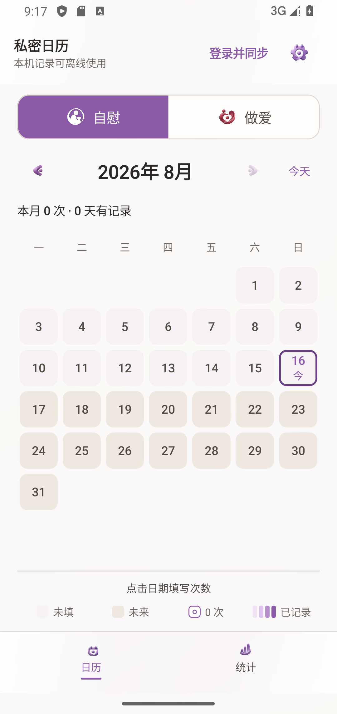
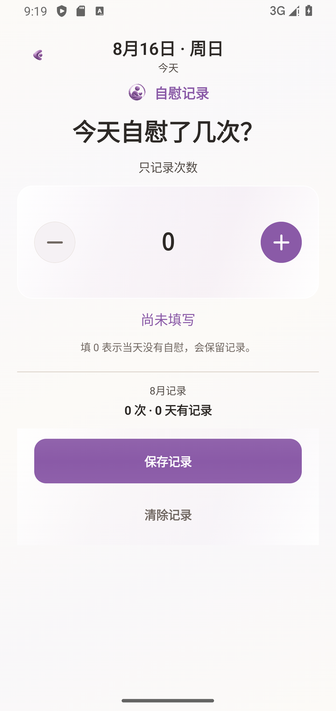
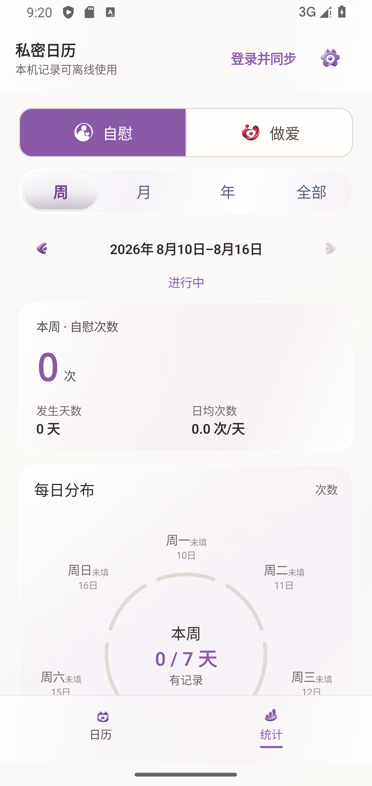

# 当前 README 运行截图

状态：`current runtime evidence`

采集日期：2026-08-16

这组图片是从本次文档刷新分支基于公共 `main` 的 `04499ec` 基线构建并安装到
Pixel 4 API 34 测试模拟器后采集的真实运行画面。设备为 1080×2280、440 dpi；应用使用
“本机记录”模式，截图中的数据为空，不包含真实账号、真实记录或云端数据。

这些是 Debug 运行证据，不是 GitHub Release APK，也不是设计稿。首页使用它们展示当前
运行时；历史审计目录中的截图继续保留，用于追溯当时的设备、输入和结论，不能当作首页
当前画面。

## 当前画面

| 页面 | 截图 |
| --- | --- |
| 日历 |  |
| 日期记录 |  |
| 统计 |  |

## 复现边界

```powershell
adb devices -l
.\gradlew.bat :app:installDebug --console=plain
adb -s <测试模拟器序列号> shell monkey -p io.github.litaog.dailyrecord 1
```

进入“本机记录”后依次打开日历、任意可选日期和统计页即可复现页面结构。设备测试只应
运行在可重置的专用模拟器上；不要把真实手机截图、真实数据库或带账号状态的画面放入
此目录。
