# 2026-07-19 深度 UX、稳定性与无障碍审计

## 范围与环境

- 产品边界：只记录手冲次数，不增加其他活动、目标、连续天数或预测。
- 设备：命令行指定 `emulator-5554`，Pixel 4、Android 14 / API 34；未操作真实手机。
- 视口：约 390×844dp，另验收 360×640dp 与系统字体 200%。
- 数据状态：未填写、明确 0 次、1 次、2 次、9+ 次、历史月份、空统计、账号与离线模式。
- 证据：运行截图、Compose 语义树、Room/Firebase 集成测试、Firestore 规则测试和应用日志共同判断；截图不是唯一通过依据。

## 审计流程

1. 首次启动：登录/注册、本机使用、冷启动恢复。
2. 日历：相邻月、今天、年月标题、月份/年份快速跳转、日期状态与未来边界。
3. 记录：读取、加减、明确 0 次、保存、重复保存、清除确认、未保存返回和错误重试。
4. 统计：周、月、年、全部历史，周期切换、历史锚点、空状态与明细对账。
5. 账号：登录、注册、同步状态、手动同步、退出确认、离线与跨设备恢复。
6. 可访问性：TalkBack 语义、48dp 点击目标、200% 字体、颜色对比和小屏滚动。

## 发现与处理

| 优先级 | 发现 | 处理 |
| --- | --- | --- |
| P0 | 已选本机模式仍会先初始化 Firebase，离线冷启动等待过长 | 本机偏好在根界面最先分流，Firebase 改为登录路径惰性初始化 |
| P0 | Room 首次发射前把空列表当真实数据，会短暂显示 0 次、0 天 | 引入可访问的数据库读取状态，首个真实快照前不渲染假统计 |
| P1 | 已有记录没有修改也能再次保存，产生无意义本机/云端修订 | 未改变时按钮显示“已保存”并禁用，修改后才开放保存 |
| P1 | 跨设备更新到达记录页时，未编辑草稿可能停留旧值 | 分离最新基线与本机草稿；未编辑自动刷新，已编辑继续保护草稿 |
| P1 | 同步、认证和后台工作可能吞掉协程取消 | `CancellationException` 全部继续抛出，并增加回归测试 |
| P1 | 周期标题能点但视觉上不易发现 | 增加“点此快速跳转”，保留 TalkBack 动作语义 |
| P1 | 主陶土色对白字及纸色小字未达到普通字号 4.5:1 | 调整为 `#B45335`，对白约 4.97:1、对纸色约 4.74:1 |
| P1 | 相邻月可点击日期格整体只有 38% 透明度，低视力用户难以读取 | 改为纸色背景加高对比文字，仍以文案保留次数状态 |
| P1 | Room 已提交后若 WorkManager 调度抛错，UI 会误报保存失败 | 本机事务结果与云调度解耦，调度异常不否定已落盘数据 |
| P2 | 200% 字体下日期摘要的星期可能形成偶然孤行 | 大字体时把完整日期和星期设计为两行 |

## 保留得好的部分

- 相邻月箭头与远距离年月日跳转分工明确；1970 下限、今天上限、短月与闰年边界已有自动化覆盖。
- 未填写、明确 0 次和已手冲使用数字、文字、背景与边框共同表达，不只依赖颜色。
- 周/月/年/全部历史共享同一浏览锚点，切换月份后周明细重新计算，不串月。
- Room 是唯一运行时事实源；保存和清除先落本机，云端仅作为可选换机恢复通道。
- 统计用精确指标和明细表，不展示预测；小数据阶段不为了装饰引入图表依赖。

## 视觉证据

### 原始基线

| 日历 | 快速跳转 | 记录 | 统计 |
| --- | --- | --- | --- |
| 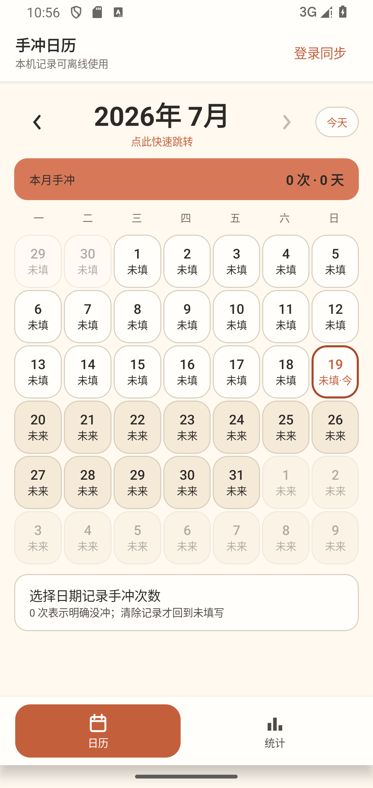 | 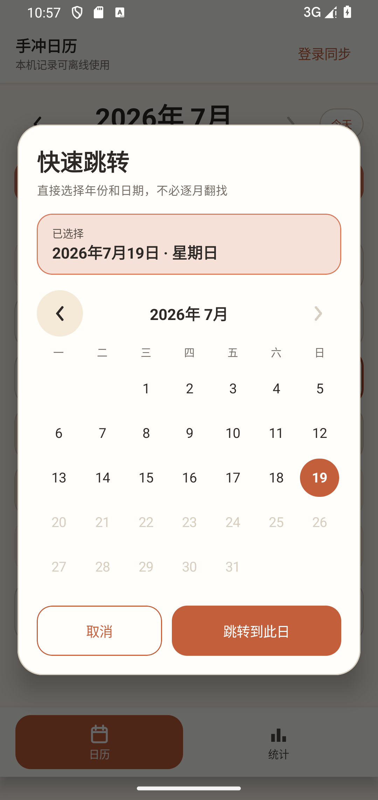 | 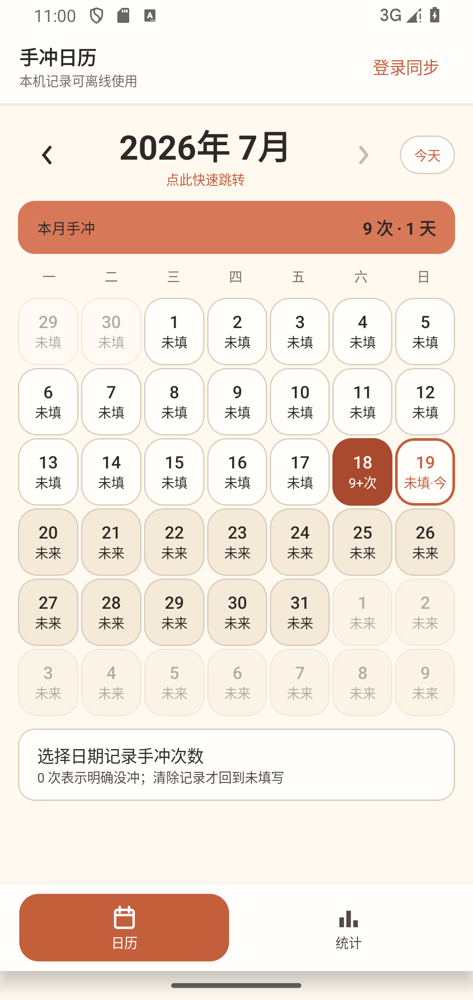 | 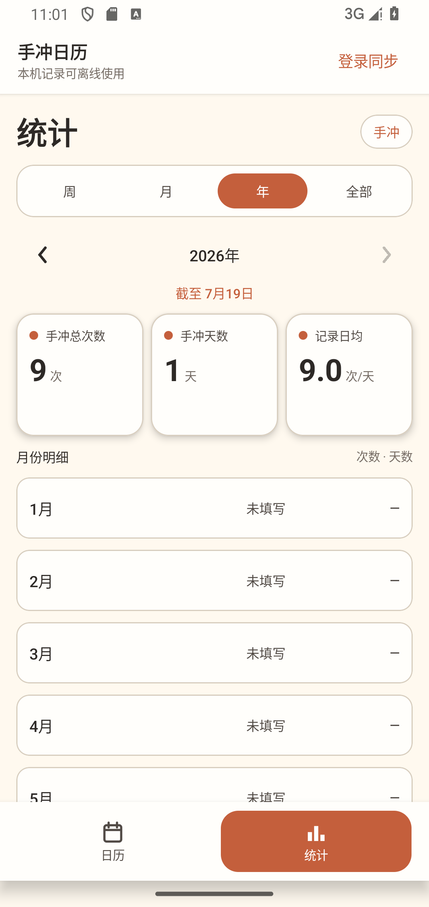 |

### 最终 APK 改进证据

| 登录入口 | 日历 | 统计入口 | 200% 日期选择 |
| --- | --- | --- | --- |
| 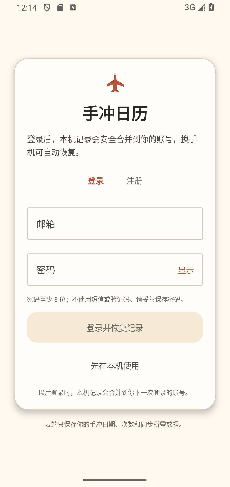 | 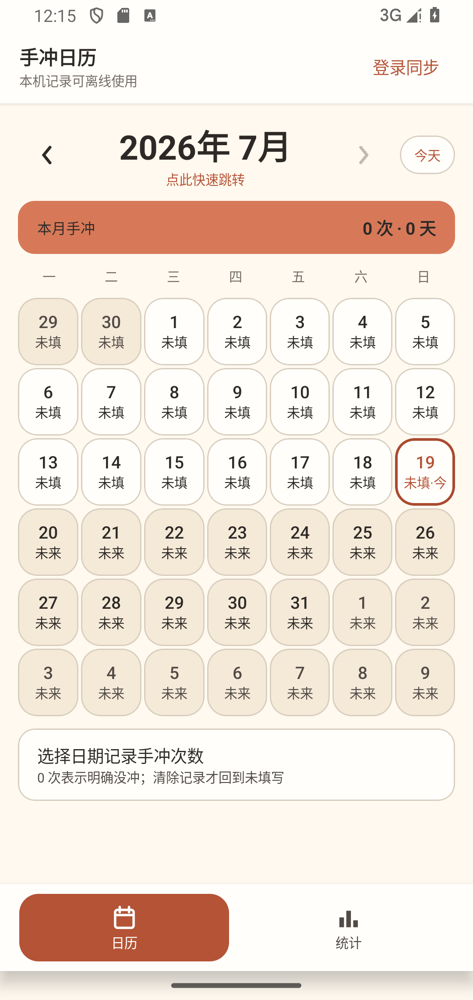 | 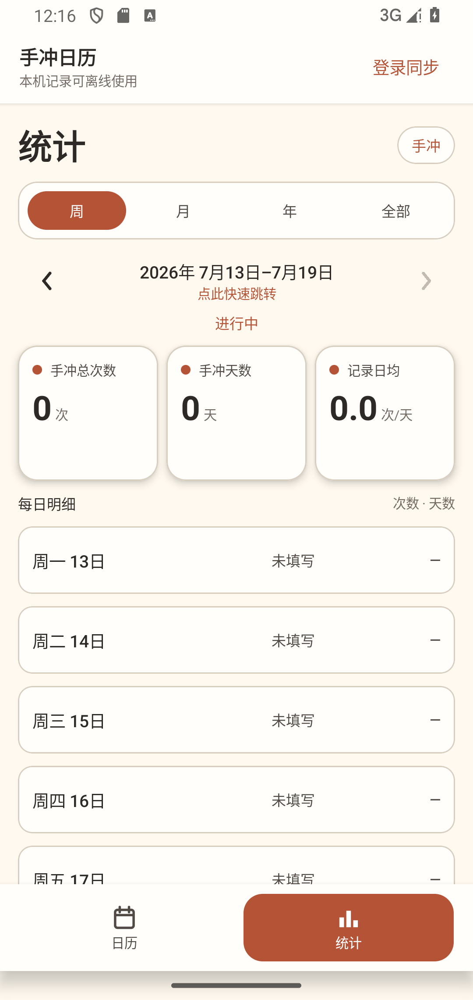 | 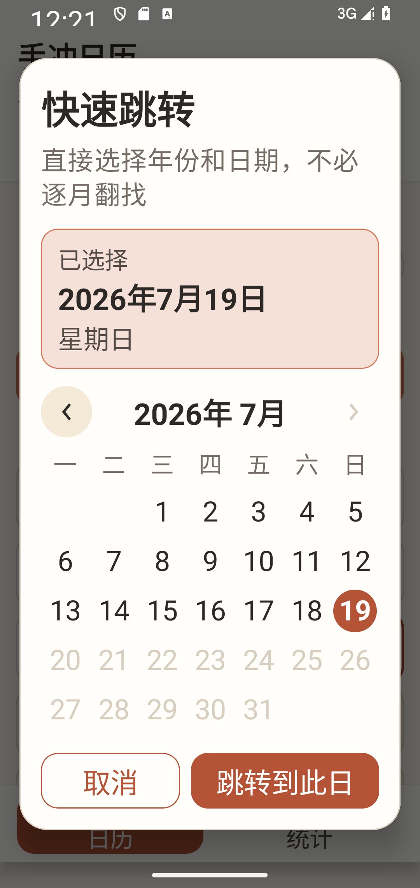 |

| 360×640 日历 | 360×640 统计 | 200% 日历 |
| --- | --- | --- |
| 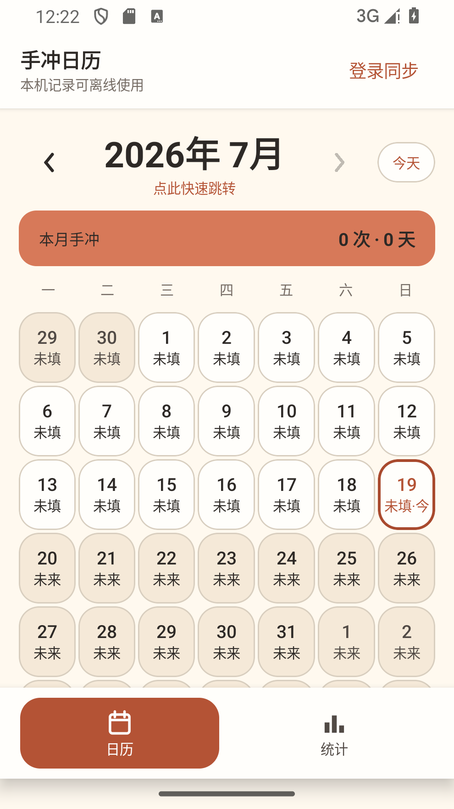 | 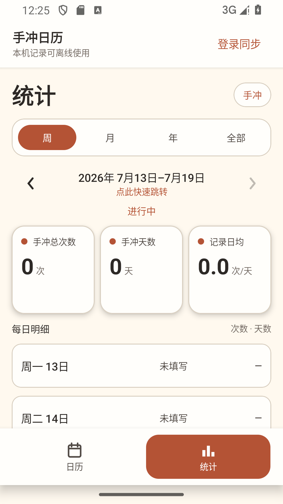 | 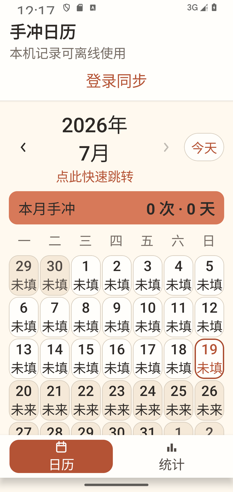 |

### 前后对照

| 日历可读性 | 统计入口 | 200% 日期摘要 |
| --- | --- | --- |
| 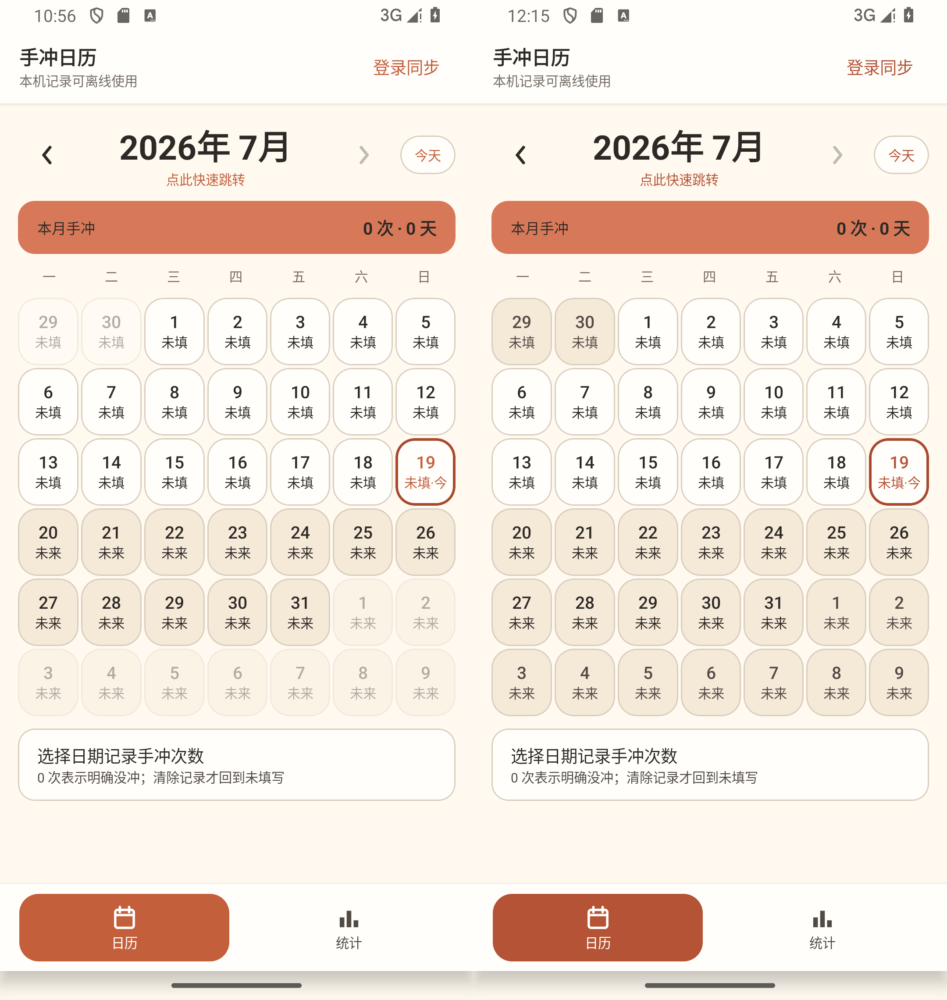 | 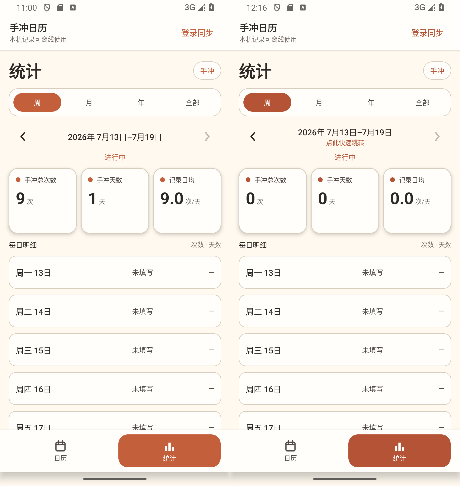 | 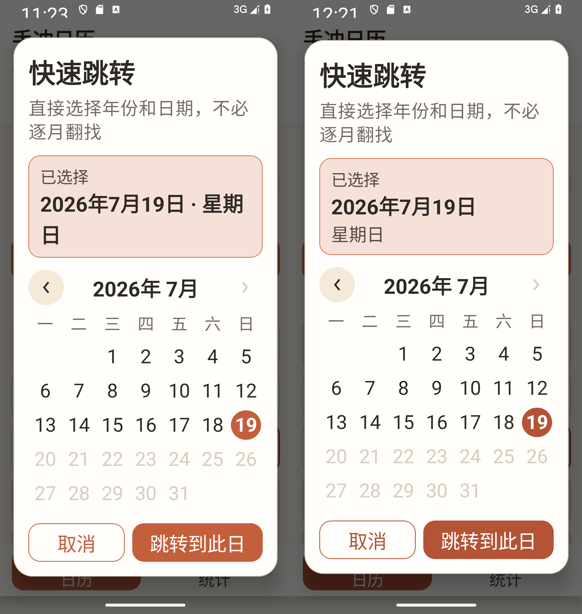 |

相应 XML 文件保存了设备语义树，用于检查可读名称、按钮角色、禁用状态和日期说明。所有最终截图都来自本分支 Debug APK；360×640、390×844 与 200% 字体证据已经完整归档在 `after/`。

## 自动化与运行时结论

- JVM 单元测试：28 项通过。
- Android 设备测试：47 项收集，46 项通过、0 失败、1 项生产冒烟按设计跳过；最后一次同步取消修复另以 7/7 定向设备回归复核。
- Firestore 规则：所有权、字段形状、修订单调性与删除墓碑用例通过。
- Android Lint：0 错误，7 条仅为 SDK/依赖可升级提示。
- 模拟器运行日志：未发现应用 FATAL、ANR、`AndroidRuntime` 崩溃或 StrictMode 违规。

## 开源参考结论

- Kizitonwose Calendar（MIT）：采用远距离定位与边界思路，不复制代码，不引入依赖。
- Vico（Apache-2.0）：当前不采用；精确表格比稀疏趋势图更有信息价值。
- Now in Android（Apache-2.0）：只参考状态管理、测试与可访问性策略。
- Loop Habit Tracker（GPL-3.0）：只参考快速离线记录体验，不复制任何代码或资产。

详见 [`RESEARCH_OPEN_SOURCE.md`](../../RESEARCH_OPEN_SOURCE.md)。

## 剩余真实手机门槛

- OLED/LCD 实机上的纸色、陶土色与系统深浅色状态栏观感。
- TalkBack 连续滑动顺序、中文播报自然度和返回手势手感。
- 弱网、蜂窝/Wi-Fi 切换、杀进程后的待同步恢复。
- 两台真实设备登录同一账号后的可感知同步延迟与冲突提示。
- 小手单手操作、实体键盘/输入法差异及至少 15 分钟连续使用的发热与耗电。
