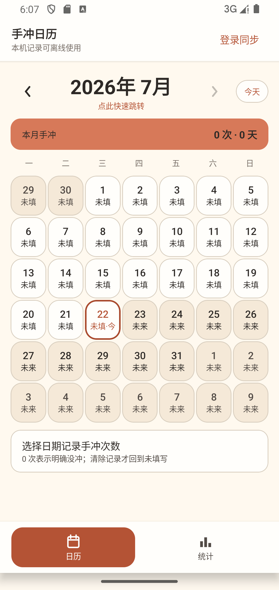
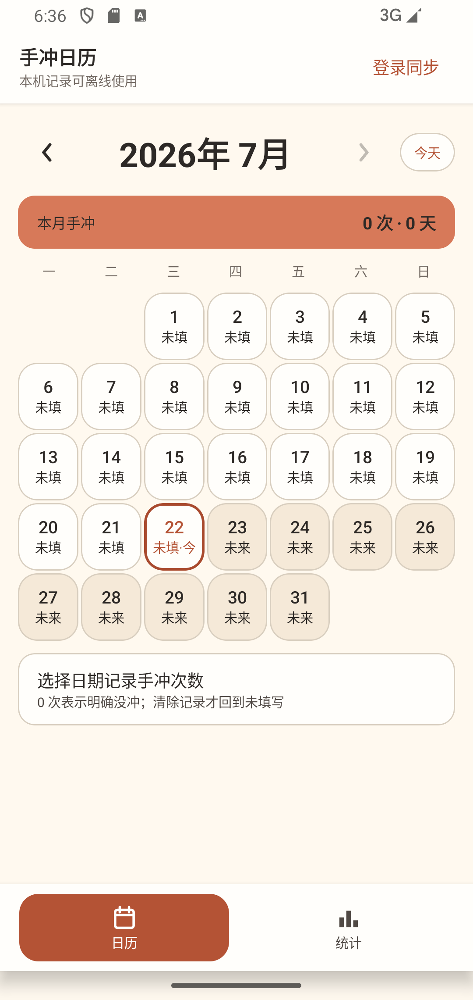
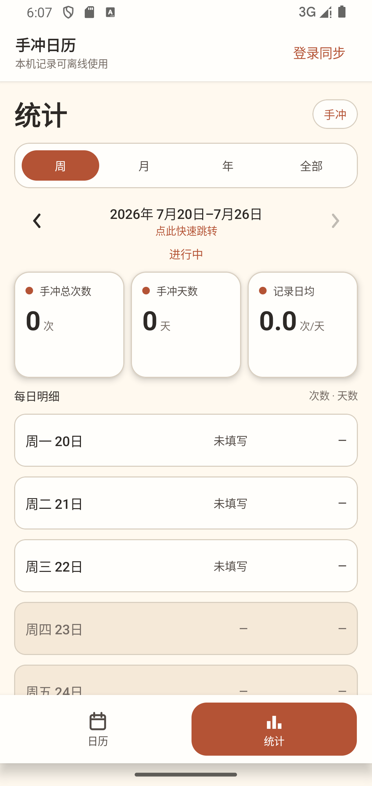
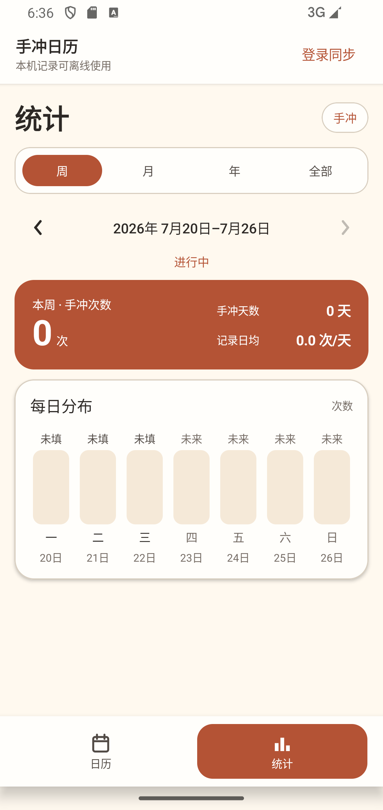
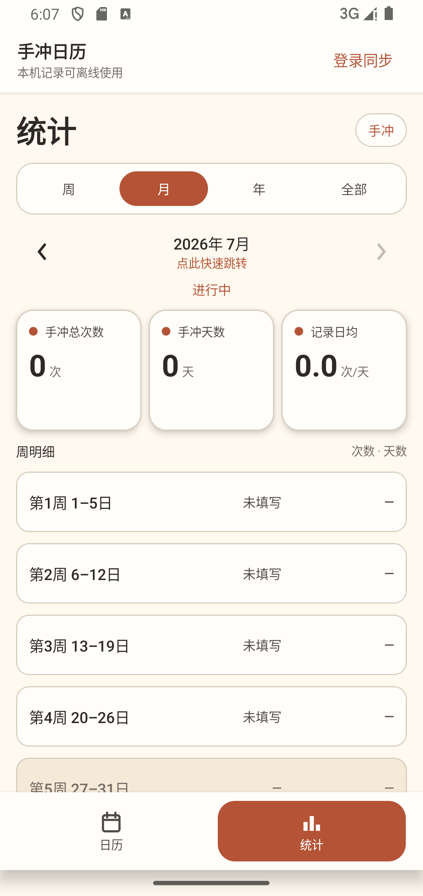
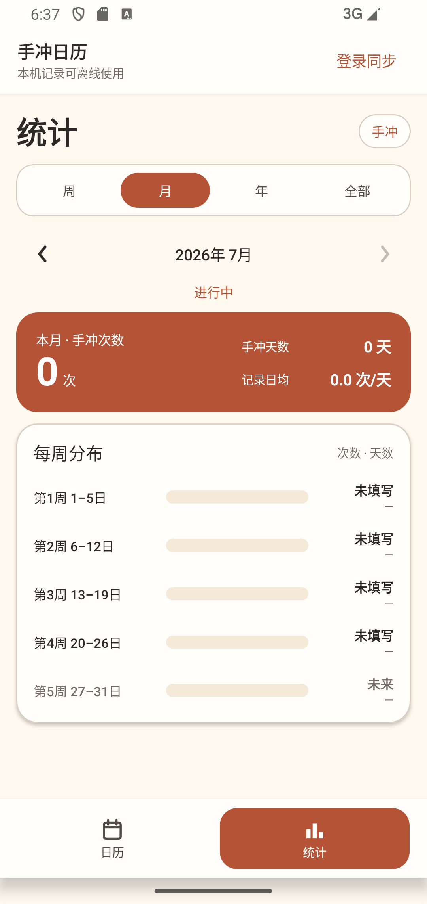
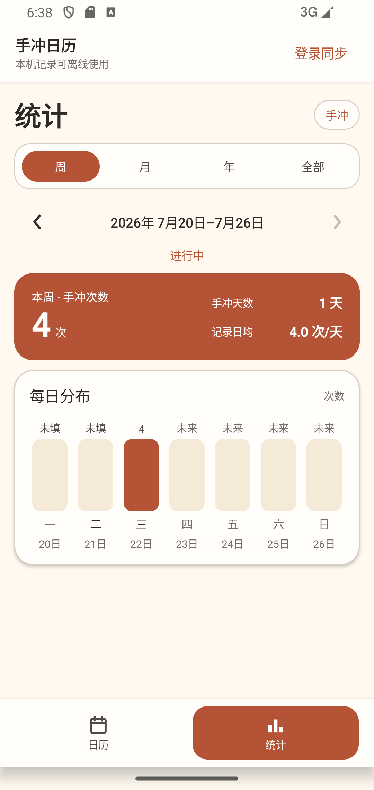
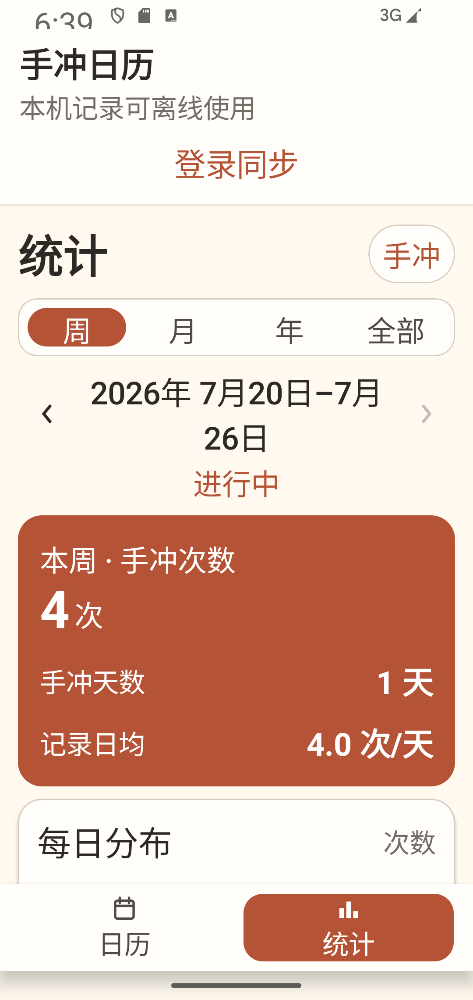

# 2026-07-22 月历与统计 UX 审计

## 范围

- API 34 `emulator-5554`，同一 Debug 应用、同一 1080×2280 视口。
- 月历当前月份、周统计、月统计、真实 UI 保存的 4 次手冲数据和系统字体 200%。
- 统计口径未改动；云同步、Room schema、年统计和全部历史不在本轮重构范围。

## 审计结论

1. 月历旧版把前后月份日期渲染成完整卡片，主月份边界不够清楚；新版只显示本月日期，空位不响应点击且不进入语义树。
2. 年月与统计周期标题继续作为 48dp 以上的点击区域并保留 TalkBack 动作说明，但删除重复的“点此快速跳转”视觉副标题。
3. 周/月旧版使用三张同权重指标卡和重复列表，信息主次弱；新版用陶土色主摘要聚焦总次数，再以七日纵向分布或每周横向分布直接标注真实数据。
4. 未填写、明确 0 次、正次数和未来状态不只依赖颜色；分布卡的合并语义会读出日期范围、次数和天数。
5. 200% 字体下周期标题允许有意换行，摘要卡切换为纵向结构，页面保持可滚动；没有发现文字裁切或关键入口不可达。

## 同视口对比

| 页面 | 修改前 | 修改后 |
|---|---|---|
| 月历 |  |  |
| 周统计 |  |  |
| 月统计 |  |  |

## 数据与大字体证据

| 真实记录分布 | 200% 字体 |
|---|---|
|  |  |

## 自动化门禁

- 月历设备测试验证前后月份日期不存在于语义树，本月日期仍存在。
- 应用设备测试验证两个页面不再显示副标题，标题仍能打开快速跳转弹窗。
- 周/月分布卡有稳定测试标识；月统计切换后仍由 `anchorDate` 重建周桶。
- JVM 统计测试继续验证明确 0、未填写、未来、跨月、溢出和汇总对账。
- 最终定向设备回归共 14 项，14 通过、0 失败、0 跳过；Debug、AndroidTest APK 构建通过。
- Lint 为 0 error、7 条版本升级提示；本轮没有改动依赖、Room、云同步或 Firestore 规则，因此不重复执行这些未受影响的全套回归。
