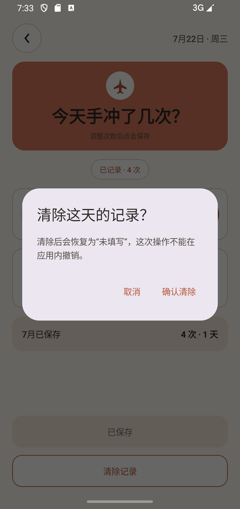
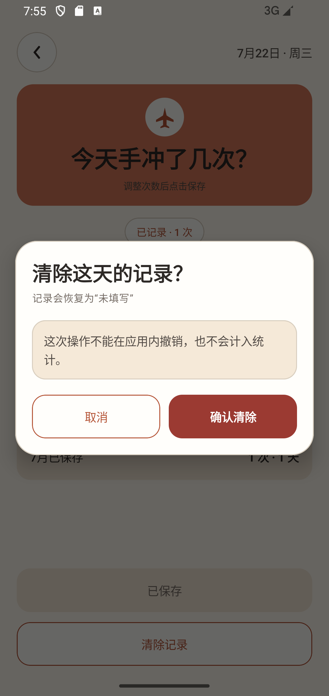
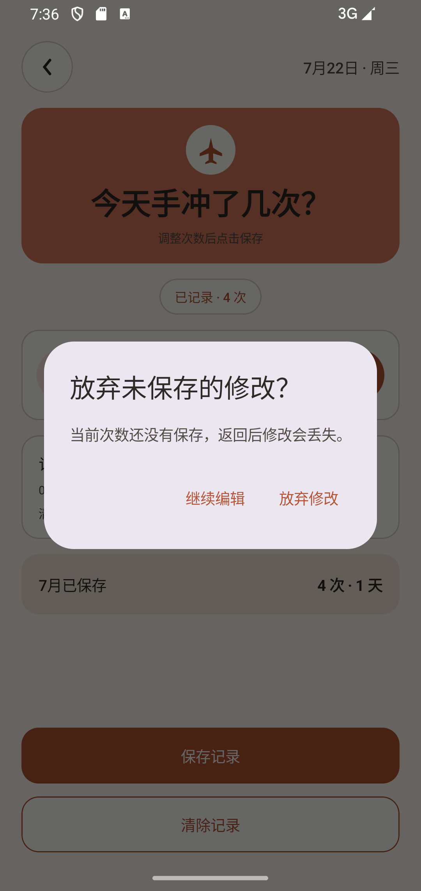
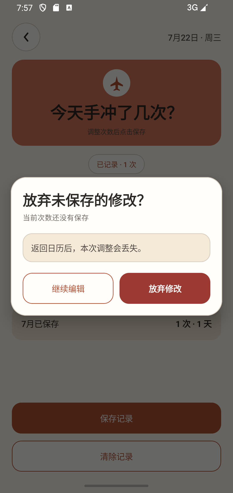
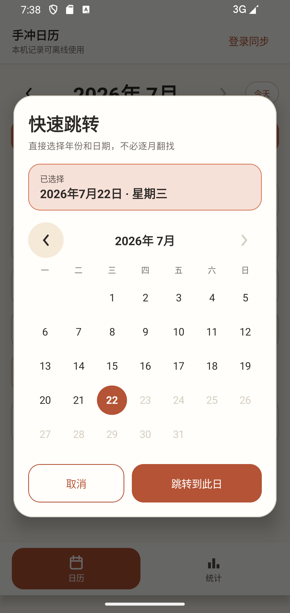
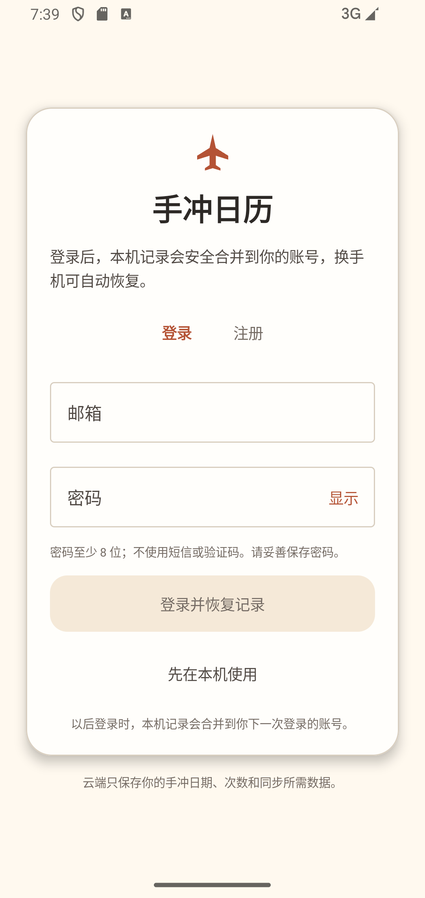
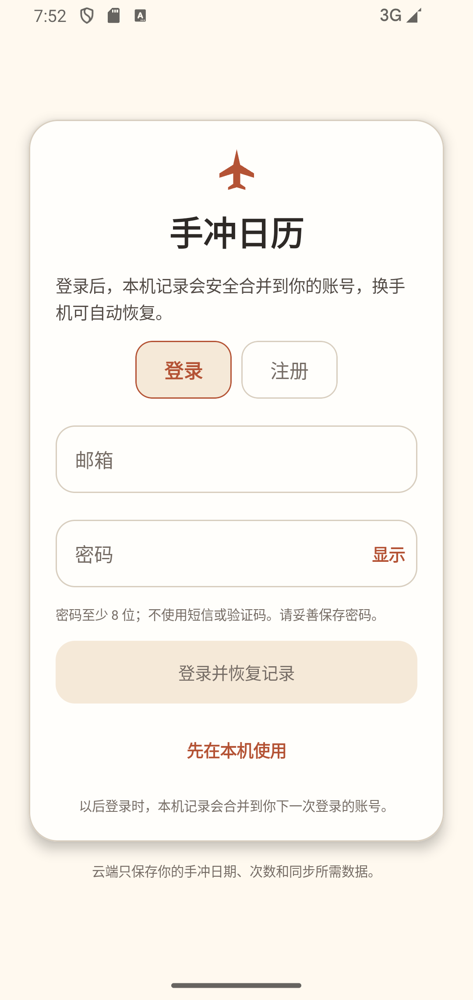
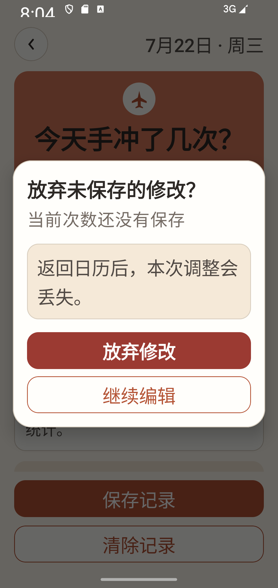

# 2026-07-22 应用内 UI 一致性审计

## 范围

- API 34 `emulator-5554`，1080×2280，同一 Debug 构建。
- 日历进入日期记录页、清除记录、未保存返回、快速日期跳转和登录入口。
- 同步检查运行时 Compose 源码中的 `AlertDialog`、`TextButton`、`SnackbarHost`、输入框、加载反馈和系统窗口主题。

## 结论

1. **记录页——健康。** 页面自身已经使用纸色、陶土色、16/20dp 圆角和项目按钮，不需要重做。
2. **清除确认——已修复。** 原实现直接使用 Material `AlertDialog`，出现淡紫色容器、默认按钮层级和项目视觉脱节；现改为共用 `HandBrewDialog`，补充“恢复未填写”和不可撤销说明，危险操作使用独立深红主按钮。
3. **未保存返回——已修复。** 原实现同样使用默认 `AlertDialog`；现与清除确认共用同一个确认组件，取消操作保持描边按钮，放弃操作明确使用危险色。
4. **快速日期跳转与账号——保持。** 两处原本已经使用应用内弹窗容器，没有调用系统日期选择器或默认确认框；本轮不改变行为。
5. **登录与错误反馈——已收口。** 登录/注册切换、密码显示、离线入口和账号退出不再使用默认 `TextButton`；输入框显式固定纸色容器、圆角、边框和焦点色；保存/清除失败 Snackbar 使用项目自有深色反馈条。
6. **系统边界——合理保留。** 状态栏、导航栏、软键盘、Android 无障碍服务和底层 `Dialog` 窗口机制继续由系统负责；应用可见内容全部由项目主题和组件绘制。当前应用不申请会触发运行时系统权限弹窗的权限。

## 前后对比

| 流程 | 修改前 | 修改后 |
|---|---|---|
| 清除记录 |  |  |
| 放弃修改 |  |  |

组合对比：[清除记录](comparison-clear.png) · [放弃修改](comparison-discard.png)

## 其余入口证据

| 入口 | 证据 | 结论 |
|---|---|---|
| 快速日期跳转 |  | 已是应用内纸色弹窗，保留 |
| 登录页修改前 |  | 主体一致，切换与文字按钮仍有默认样式 |
| 登录页修改后 |  | 切换改为明确的圆角分段，文字入口和输入框状态显式主题化 |
| 200% 字体 |  | 标题不再孤字换行，操作纵向排列且均可见 |

## 自动化与源码门禁

- 运行时源码不再包含 Material `AlertDialog` 或 `TextButton`。
- `clear_record_dialog`、`discard_record_dialog` 和 `hand_brew_snackbar` 均有稳定测试标识。
- 记录、认证和账号定向设备回归共 14 项，14 通过、0 失败、0 跳过。
- 最终标题字阶调整后，在系统字体 200% 下复跑记录页 8 项设备测试，8 通过、0 失败、0 跳过。
- JVM 单元测试通过；Debug、AndroidTest 编译通过；Lint 0 error、7 条版本升级提示。
- 本轮未修改 Room、Firebase、Firestore 规则、同步协议或任何业务统计逻辑，因此不重复运行未受影响的云端与规则全套测试。

## 截图能证明与不能证明的内容

截图和语义树能证明布局、层级、文字、按钮可达性和 200% 字体状态。TalkBack 的真实朗读音序、厂商键盘外观以及系统状态栏/导航栏的设备差异仍需依赖系统和真机环境，不能仅凭截图声明完全一致。
