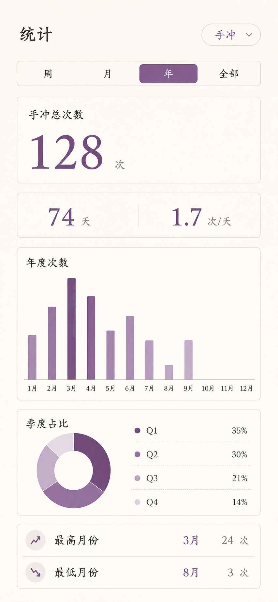

# 2026-08-01 UI v2 Stage 4：月度热力图与年度月份分析

状态：`implementation verified — awaiting user acceptance`

对应 Goal：[UI v2 分阶段执行计划](../../QUIET_PRIVATE_JOURNAL_GOALS.md)；对应 Issue：[#39](https://github.com/LitaoG/daily-record-app/issues/39)。

本阶段在用户明确要求“继续下一个阶段”后启动。Stage 3 的验收 Issue #43 仍保持开放，本阶段不关闭、不覆盖它；Stage 4 完成后停在本页状态，等待用户验收，不启动 Stage 5。

## 本阶段冻结的产品结果

- 月统计改为当前模块的真实 `LocalDate` 方形热力图：只生成当月真实日期，网格补位不算日期；五周、六周和闰年二月分别由模型测试保护。
- 过去未填写、明确保存 0 次、正次数和未来日期使用不同的状态；未来日期不绘制柱高，也不在格内显示“未来”文字，完整解释保留在 TalkBack 语义和图例中。
- 年统计使用 12 个月次数柱状图，不再使用手机端拥挤的年度 53×7 日热力图；当前未完成月份可以展示事实，但不进入最高/最低月份排名。
- 年统计补充季度次数占比、最高月份、最低月份和明确空状态；并列月份完整列出。季度总数来自同一模块的月汇总，0 次不制造饼环比例。
- 周、月、年、全部继续共享同一 `anchorDate` 和单模块记录输入；手冲与做爱不会互相读取或混入。

## 调研刷新与取舍

本阶段只借鉴公开产品的信息层级，不复制代码、图标或品牌资产：

- [HabitHeat](https://habitheat.com/) 展示周/月/年热力与总量、平均值、月度量，验证长期历史应优先使用低噪声强度编码。
- [HabitKit（Google Play）](https://play.google.com/store/apps/details?hl=en&id=com.roehl.habitkit) 采用可点击的方格日历和离线隐私表达，支持本项目的“真实日期格＋语义状态”方向。
- [HabitBox](https://habitbox.app/) 将日历热力与总量、分析分开，支持本阶段把月热力和年分析拆成独立卡片。
- [Vico Cartesian Charts](https://guide.vico.patrykandpatrick.com/android/compose/cartesian-charts/cartesianchart) 说明 Compose 柱状图可按单个数据点定制；本阶段使用轻量原生 Compose 绘制，避免为一张 12 月图引入新运行时依赖。

因此本阶段选择“月度热力＋年度 12 月柱状＋季度占比＋极值摘要”，不把折线图、年度逐日热力图和三张等权 KPI 卡同时堆叠在手机屏幕上。

## 设计与运行证据

高保真方向图（390×844 概念视口；数值和日期拓扑仍以代码及测试为准）：



API 34 模拟器定向运行截图（390×844 视口）：

- [周统计](statistics-week.png)
- [月统计真实日期热力图](statistics-month.png)
- [年统计](statistics-year.png)
- [年统计（200% 字体，滚动区域 1）](statistics-year-font200.png)
- [年统计（200% 字体，滚动区域 2）](statistics-year-font200-scrolled.png)

运行 UI 树确认了以下证据：月份页面包含 1–31 的真实日期语义，未来日期与未填写日期的 TalkBack 描述不同；年度页面包含“年度次数”卡，单屏柱状布局覆盖 12 个月并提供完整月度语义；统计页面未崩溃，底部导航和周期切换仍可访问。

200% 字体验证通过：年度柱状卡、季度空状态和月份摘要均在可滚动内容中保持完整，未出现文本截断或按钮重叠；`statistics-year-font200*.png` 为两次 UI 树滚动后的证据。

## 代码边界

- `StatisticsModels.kt` 负责日期集合、记录状态、年度月份、季度和极值的纯模型计算。
- `StatisticsStage4Components.kt` 只负责 Compose 展示、状态颜色和无障碍描述；不写入数据库、不改变同步协议。
- `StatisticsScreen.kt` 只编排既有周期导航与新卡片；周/全部的现有事实列表继续保留。
- 本阶段不新增时间、感受、文本框、目标、提醒、第三个模块或通用活动数据库。

## 已执行验证

定向验证已通过：

```text
testDebugUnitTest --tests *StatisticsModelsTest --tests *SexStatisticsModelsTest : passed
compileDebugKotlin : passed
lintDebug : passed
installDebug : passed on emulator-5554 (API 34)
```

最终小版本门禁已通过：

```text
testDebugUnitTest : 90 tests, 0 failures
lintDebug : passed
assembleDebug / assembleDebugAndroidTest : passed
Firestore Rules emulator : passed
connectedDebugAndroidTest : 90 tests, 0 failures, 1 designed skip
Release merged Manifest : usesCleartextTraffic=false
```

全量 connected 套件第一次运行时暴露了两个兼容问题（月份标题重复、记录页 0 次说明缺失）；修复后受影响的 21 个测试先通过，模拟器重启并清理残留 Firebase 进程后再次运行完整 90 项，最终 0 失败。生产 Firebase 烟雾测试按仓库策略保留 1 项跳过。

模型回归覆盖：

- 月份真实日期不重复、不遗漏，八月 31 天和 6 周补位。
- 2028 年 2 月只生成 29 个真实日期。
- 明确 0 次与未来日期保持不同状态。
- 当前月份保留总量但不参与极值；已完成月份的并列最高/最低和季度总量可重算。

提交前仍需在本阶段最终功能 head 上运行仓库规定的增量门禁、文档检查、全量 JVM/Lint、Firestore Rules 和 connected Android suite；纯截图或说明修订不机械重复无关套件，详见 [`TESTING.md`](../../../TESTING.md)。

## 验收暂停点

本阶段实现和证据完成后，Issue #39 应标为 `status:awaiting-acceptance` 并暂停。用户验收重点：

1. 月份切换后日期格确实重建，不残留上一个月的周桶或颜色。
2. 0 次、未填写、未来日期在视觉上能区分，且 0 次柱高为零。
3. 年度柱状图 12 个月均可看见，未来月份为空，季度与最高/最低摘要易读。
4. 手冲和做爱分别切换时统计不串数据。
