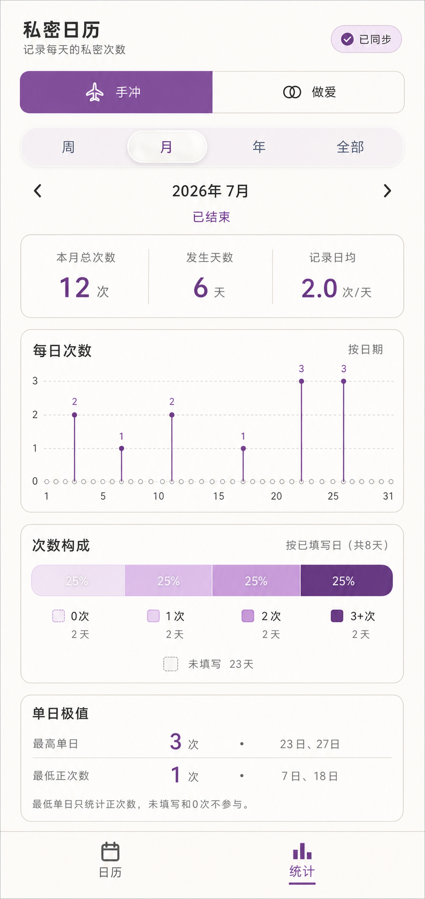
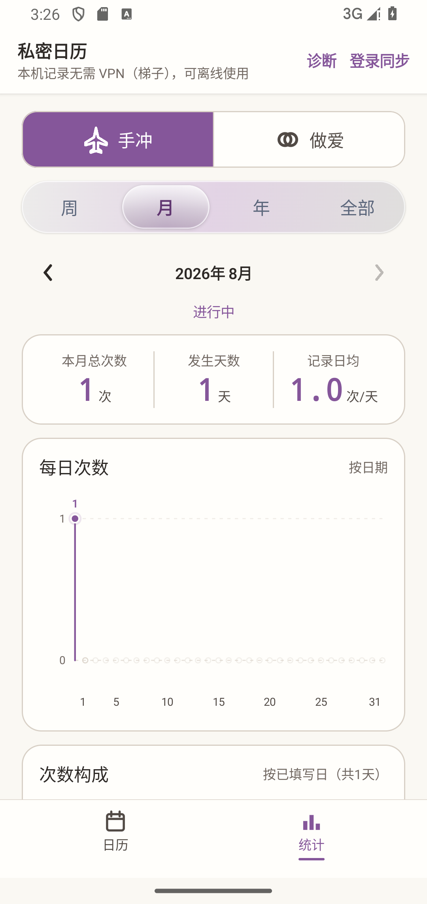
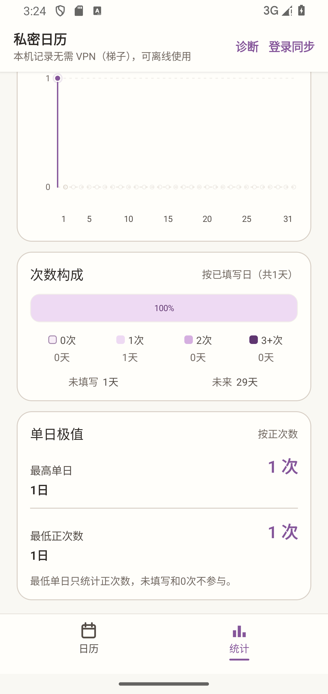
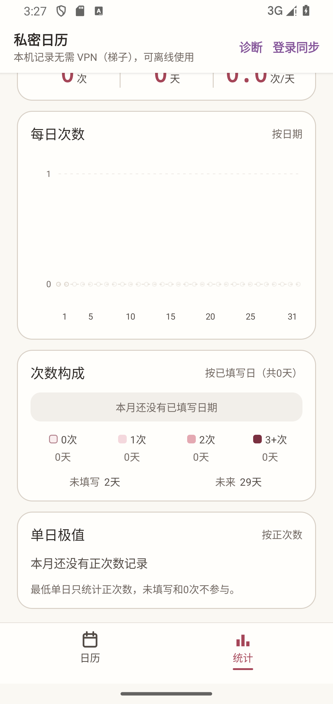
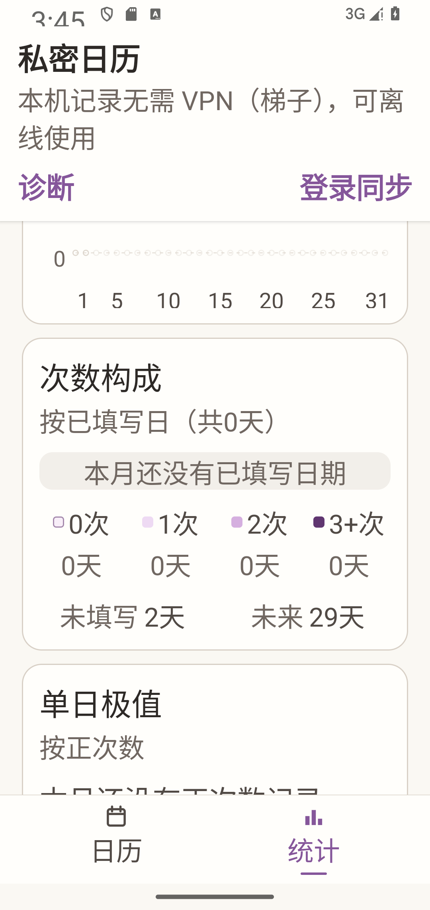

# 月统计重构视觉验收

> 状态：历史验收证据。本文记录当时的月统计实现和截图；当前月统计契约以 [`MONTH_STATISTICS_REDESIGN.md`](../../MONTH_STATISTICS_REDESIGN.md) 为准。

本轮把月统计从“按周汇总”改为互补于日历页的数据分析视图：精简月度汇总、逐日次数脉冲图、已填写日次数构成，以及最高/最低单日次数。

## 对照材料

| 设计目标 | Android 顶部实现 |
| --- | --- |
|  |  |

| 自慰下半页 | 做爱下半页 | 200% 字体 |
| --- | --- | --- |
|  |  |  |

## 验收结论

- 逐日图覆盖当月全部真实日期，不复刻主页日期格，也不再按第 1–6 周聚合。
- 明确 `0`、过去未填写、正次数和未来日期使用不同的点语义；未来不预测。
- 次数构成只以已填写日期为分母，使用 `0 / 1 / 2 / 3+` 四档；未填写和未来单独列出。
- 极值卡只显示最高单日和最低单日次数，不展开并列日期；最低单日只统计正次数。
- 紫色自慰与深红做爱主题均由模块颜色令牌驱动。
- 在约 `393dp` 宽度及 `200%` 系统字体下未发现横向溢出；大字体时卡片标题与说明自动改为纵向排列。
