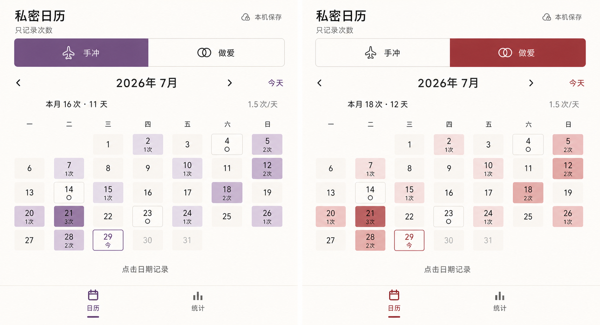
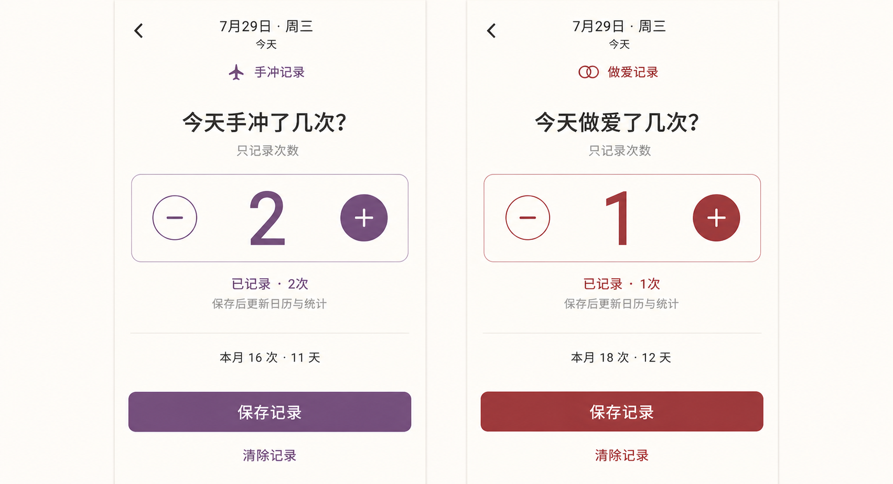
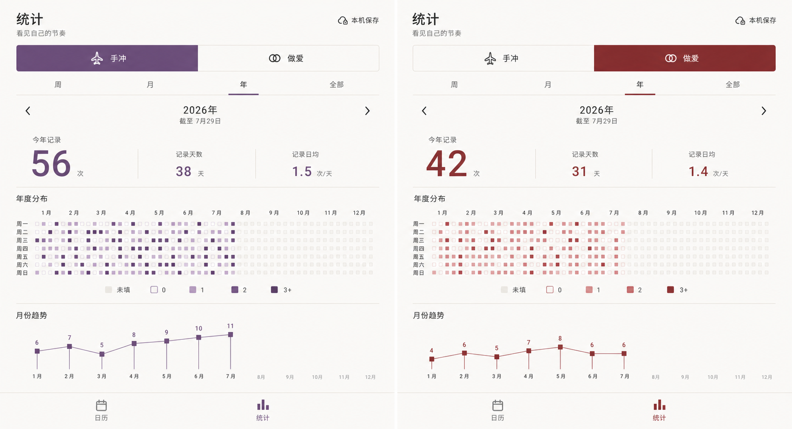

# 安静的私密数据日志 UI v2 设计基线

状态：`Accepted visual target — Stages 1–2 implemented; Stages 3–4 pending`

确认日期：2026-07-29

执行计划：[分阶段 Goal](../../QUIET_PRIVATE_JOURNAL_GOALS.md)

## 设计结论

本目录保存下一轮 Android UI 改版已经确认的视觉方向。三张图分别覆盖日历、日期记录和统计，且每张图都并排展示同一页面的两个模块状态：

- 手冲使用克制的紫色系。
- 做爱使用克制的深红色系。
- 页面结构、排版、间距、圆角、底部导航和中性色保持一致。
- 模块色只负责身份、焦点、主操作和次数热力，不承担全部状态语义。

| 角色 | 基线值 |
|---|---|
| Canvas | `#FAF8F3` |
| Surface | `#FFFEFB` |
| Primary text | `#2D2926` |
| Subtle line | `#D8D0C6` |
| 手冲主色 | `#85569A` |
| 手冲深色 | `#603670` |
| 做爱主色 | `#A54658` |
| 做爱深色 | `#7A3040` |

这些值是实现起点。阶段 1 可以为普通文字、白字按钮、焦点和禁用状态做必要的 WCAG 对比度调整，但不得改变紫色/深红色方向，且必须在 PR 中记录最终 token。

## Stage 1 最终 Token

阶段 1 保留全部已确认基线值，并补齐以下语义色：

| 角色 | 最终值 |
|---|---|
| Muted surface | `#F2EFEA` |
| Secondary text | `#514A45` |
| Muted text | `#706761` |
| Success | `#3F6F5A` |
| Success container | `#E1ECE5` |
| Warning | `#8A6A18` |
| Danger | `#9B3A32` |
| Danger container | `#F5E3E1` |
| 手冲 1 次 / 2 次 | `#E9DDEA` / `#C8AFCF` |
| 做爱 1 次 / 2 次 | `#F2DCDD` / `#DFAEB2` |

共享状态映射：

- 未填写：中性浅底、正文和细分隔线。
- 明确 0：Surface 底、当前模块主色内容和描边。
- 1、2、3+：当前模块由浅到深的同色阶。
- 焦点：当前模块深色。
- 禁用：中性浅底与 Muted text。

白字对两个模块主色、正文对 Canvas、Muted text 对 Muted surface 均由单元测试验证达到普通文本 WCAG AA。运行时实现和 200% 字体证据见 [Stage 1 验收](../../audit/2026-07-30-ui-v2-stage1/README.md)。

## 日历页

冻结规则：

- 模块切换器为单层二等分，选中颜色和点击范围都占满外框一半。
- 日期采用轻微圆角方形单元，以当前模块同色系整格深浅表达次数。
- 未填写不显示“未填”；未来不显示“未来”；今天保留“今”。
- 明确 0 与未填写保持不同，不能只依赖颜色。
- 日历只负责浏览和选择；点击日期后进入记录页，不在日期格内直接加减。

## 日期记录页

冻结规则：

- 顶部明确日期和当前模块；不提供第三个底部导航入口。
- 次数是页面唯一主焦点，`-1`、`+1` 至少 48dp。
- 保存是唯一主按钮，清除是次级操作。
- 现有加载、草稿、保存、清除、失败和返回确认逻辑保持不变。
- 本轮不显示时间、感受、备注或文本框；这些字段以后若需要必须单独立项。

## 统计页

年度折线的节点、刻度、面积渐变和月份轴方向参考
[`annual-line-chart-reference-rough.png`](annual-line-chart-reference-rough.png)。该图只是粗略构图参考；未填写和未来月份仍必须遵守下方冻结规则，不能照图伪装成 0。

冻结规则：

- 周 / 月 / 年 / 全部使用等宽四段式玻璃胶囊：半透明乳白外层、内缩白色悬浮滑块、跟随当前模块色阶的轻微辉光；手冲使用紫色，做爱使用深红色。不使用下划线、图标或高饱和整块按钮。选中滑块和文字仍跟随当前模块色阶。
- 总次数是唯一主指标；发生天数和记录日均是辅助事实。
- 周、月、年、全部使用同一浏览日期、统计口径与视觉语法。
- 月统计使用完整逐日次数脉冲图、按已填写日计算的 `0 / 1 / 2 / 3+` 次数构成和单日极值；不按周汇总，也不重复主页日期网格。明确 0、过去未填写和未来日期使用不同基线点，未来不预测，最低极值只统计正次数。
- 年统计使用单张 12 个月直线折线面积图、季度占比圆环、月均次数、最高月份和最低月份，不再使用手机端过密的 53×7 年度逐日热力图。相邻有效月份直接用直线连接，不使用曲线插值。
- 每个已记录月份使用高亮实心点并在上方标记精确次数；明确 0 次落在基线，未填写和未来月份只显示空心位置标记且不参与连线。柱状图与折线图不重复堆叠。
- 年度折线在进入年度统计或切换年度数据时从左向右揭示一次；坐标、月份与空心状态点不参与动画，完成后保持静止，禁止循环播放。
- 旧图中的年度热力图区域已被 2026-07-30 的产品决策替代；Stage 4 实现前必须先结合既有竞品研究和届时的优秀移动统计案例，补充新的统计页高保真图。参考产品只提供信息层级、图表密度、动效和空状态启发，不限制新构图，也不直接复制闭源或 GPL 资产与代码。
- 手冲和做爱分别读取自己的数据集，不能合并或交叉读取。

2026-08-02 的定向实现与同图对照证据见
[`年度折线与季度圆环验收`](../../audit/2026-08-02-year-line-chart/README.md)。

## 生成图的使用边界

这些图是高保真视觉参考，不是可直接抄写的布局坐标或数据结果：

- 图中的日期、次数和趋势值是演示数据。
- 月度周桶必须由 `LocalDate` 按周一至周日边界生成；只汇总所选月份内的真实日期，不能从图片数柱子或复制随机分布。
- 真实实现必须另外验证 390×844、窄屏、200% 字体、48dp 点击目标、TalkBack、颜色对比度和组合状态。
- 当前已经实现的业务、同步、数据库和错误处理仍以代码及当前事实文档为准。
- 如果生成图与 [`PRODUCT.md`](../../../PRODUCT.md)、[`UI_UX.md`](../../../UI_UX.md)、[`STATISTICS.md`](../../../STATISTICS.md) 或 [`DECISIONS.md`](../../../DECISIONS.md)冲突，以事实文档为准并在对应阶段修正设计细节。

## 资产清单

| 文件 | 尺寸 | SHA-256 |
|---|---:|---|
| `calendar-purple-red-v2.png` | 1705×923 | `4F04D06BDDC8E1A8B038B74F965CC612DF7C7E7205D918DBD61F557A49010647` |
| `record-purple-red-v2.png` | 1703×924 | `96266318F1605D3523FCCD267CC40AA56878704E339E56EAF3CFB0129D12773F` |
| `statistics-purple-red-v2.png` | 1704×923 | `F294327744353F1623C7FCCD6C7AC6166D98EEE174CC5FB2028FDBC10C1A0CBB` |

图像由内置图像生成工具创建并在 2026-07-29 经用户确认方向。实现前不得继续用旧陶土橙、深铜或旧 Figma Hand-brew-only v2 画板覆盖本目录。
